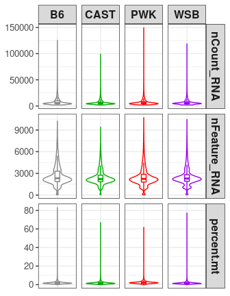
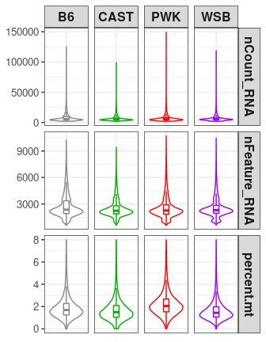
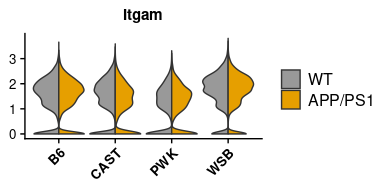
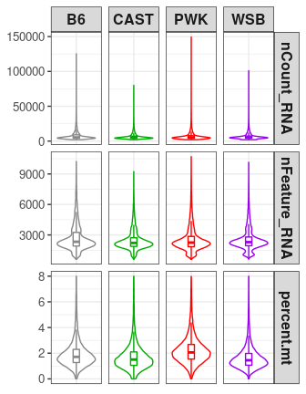
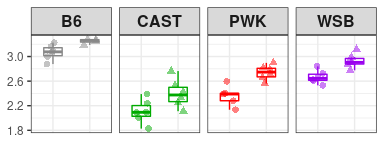

```r
knitr::opts_chunk$set(warning=FALSE, message=FALSE)
```


```r
library(tidyverse)
library(cowplot)
library(Seurat)
library(extrafont)
```


# 1. QC for merged but unintegrated data


```r
out_path <- "../03_results/02_QC_strain_split/"

cd11b.merged <- readRDS("~/code/wild_AD_mic_scRNA/02_data/intermediate_rds/emase29files_merged_raw.rds")

strain <- c("B6", "CAST", "PWK", "WSB")
cols = c("#888888", "#00AA00", "#FF0000", "#9900EE")

cd11b.merged$Strain <- str_replace(cd11b.merged$Strain, pattern = "B6J", replacement = "B6")
cd11b.merged$Strain <- factor(cd11b.merged$Strain, levels = strain)

meta <- cd11b.merged@meta.data
rm(cd11b.merged)
dim(meta)
```

```
## [1] 95229    11
```

```r
meta_tidy <- meta %>% 
  select(orig.ident, nCount_RNA, nFeature_RNA, Strain, Genotype, percent.mt) %>% 
  gather(-orig.ident, -Strain, -Genotype, key = "QC", value = "value")

# plot 
meta_tidy %>% ggplot(aes(y=value, x=orig.ident, color=Strain)) +
  facet_grid(QC ~ Strain, scales = "free_y") + 
  geom_violin() +
    geom_boxplot(width=0.15, outlier.shape = NA, alpha=0.7) +
    scale_colour_manual(values=cols) + 
    theme_bw()+
    theme(legend.position = "none", 
          axis.title = element_blank(),
          strip.text = element_text(face = "bold", size = 12, family = "Arial"),
          axis.text = element_text(size = 10),
          axis.text.x = element_blank(),
          axis.ticks.x = element_blank())
```

<!-- -->

```r
ggsave(filename = "QC01_merged_unintegrated.png", path = out_path, width = 3.5, height = 4.5, dpi = 300)

# wrap into function for the following plots
QC_plot <- function(data){
  p <- data %>% 
  select(orig.ident, nCount_RNA, nFeature_RNA, Strain, Genotype, percent.mt) %>% 
  gather(-orig.ident, -Strain, -Genotype, key = "QC", value = "value") %>% 
  ggplot(aes(y=value, x=orig.ident, color=Strain)) +
  facet_grid(QC ~ Strain, scales = "free_y") + 
  geom_violin() +
    geom_boxplot(width=0.15, outlier.shape = NA, alpha=0.7) +
    scale_colour_manual(values=cols) + 
    theme_bw()+
    theme(legend.position = "none", 
          axis.title = element_blank(),
          strip.text = element_text(face = "bold", size = 12, family = "Arial"),
          axis.text = element_text(size = 10),
          axis.text.x = element_blank(),
          axis.ticks.x = element_blank())
  return(p)
}

meta %>% 
  group_by(Strain) %>% 
  summarise(med_nCount_RNA=median(nCount_RNA), 
            med_nFeature_RNA=median(nFeature_RNA), 
            med_percent.mt=median(percent.mt),
            N_cells=n())
```

```
## # A tibble: 4 x 5
##   Strain med_nCount_RNA med_nFeature_RNA med_percent.mt N_cells
##   <fct>           <dbl>            <dbl>          <dbl>   <int>
## 1 B6              5517.             2324           1.71   23368
## 2 CAST            5068              2206           1.51   25744
## 3 PWK             5370.             2236           2.06   21430
## 4 WSB             5354.             2287           1.45   24687
```


# 2. QC for merged but unintegrated data, filtered


```r
meta_filter <- meta %>% 
  filter(nFeature_RNA > 600, percent.mt < 8)
dim(meta_filter)
```

```
## [1] 92698    11
```

```r
QC_plot(meta_filter)
```

<!-- -->

```r
ggsave(filename = "QC02_merged_unintegrated_filtered.png", path = out_path, width = 3.5, height = 4.5, dpi = 300)

meta_filter %>% 
  group_by(Strain) %>% 
  summarise(med_nCount_RNA=median(nCount_RNA), 
            med_nFeature_RNA=median(nFeature_RNA), 
            med_percent.mt=median(percent.mt),
            N_cells=n())
```

```
## # A tibble: 4 x 5
##   Strain med_nCount_RNA med_nFeature_RNA med_percent.mt N_cells
##   <fct>           <dbl>            <dbl>          <dbl>   <int>
## 1 B6              5531.             2350           1.70   22611
## 2 CAST            5076.             2222           1.50   25181
## 3 PWK             5370.             2261           2.06   20810
## 4 WSB             5363.             2301           1.45   24096
```

# 3. QC for after all myeloid cell integration


```r
cd11b.integrated <- readRDS("~/code/wild_AD_mic_scRNA/02_data/intermediate_rds/cd11b_integrated_r2.rds")

cd11b.integrated$Strain <- str_replace(cd11b.integrated$Strain, pattern = "B6J", replacement = "B6")
cd11b.integrated$Strain <- factor(cd11b.integrated$Strain, levels = strain)

meta_int <- cd11b.integrated@meta.data

dim(meta_int)
```

```
## [1] 91201    20
```

```r
QC_plot(meta_int)
```

<!-- -->

```r
ggsave(filename = "QC03_integrated_myeloid.png", path = out_path, width = 3.5, height = 4.5, dpi = 300)

meta_int%>% 
  group_by(Strain) %>% 
  summarise(med_nCount_RNA=median(nCount_RNA), 
            med_nFeature_RNA=median(nFeature_RNA), 
            med_percent.mt=median(percent.mt),
            N_cells=n())
```

```
## # A tibble: 4 x 5
##   Strain med_nCount_RNA med_nFeature_RNA med_percent.mt N_cells
##   <fct>           <dbl>            <dbl>          <dbl>   <int>
## 1 B6              5518.             2349           1.69   22212
## 2 CAST            5084.             2223           1.50   24976
## 3 PWK             5352.             2258           2.05   20192
## 4 WSB             5357.             2301           1.44   23821
```

# Plot Cd11b expression levels from single-cell RNA-seq regardless of Clusters


```r
## combine homeostatic microglia
cd11b.integrated$final_clusters <-  ifelse(cd11b.integrated$seurat_clusters %in% 0:5,"H",
                                           cd11b.integrated$seurat_clusters %>% as.character())
cd11b.integrated$final_clusters <- factor(cd11b.integrated$final_clusters, 
                                          levels = c("H", "6", "7", "8", "9", "10", "11", "12"))
cd11b.integrated$Genotype <- factor(cd11b.integrated$Genotype, levels = c("WT", "APP/PS1"))

cd11b.integrated$Group <- gsub("B6J", "B6", cd11b.integrated$Group)

cd11b.integrated$Group <- factor(cd11b.integrated$Group, 
                                 levels=c("B6_WT", "B6_APP/PS1", "CAST_WT", "CAST_APP/PS1", "PWK_WT","PWK_APP/PS1", "WSB_WT", "WSB_APP/PS1"))

Idents(cd11b.integrated) <- "Strain"
VlnPlot(cd11b.integrated , features = "Itgam", pt.size = 0, split.by = "Genotype", ncol = 4, cols =  c("#E69F00", "#999999")) + 
        theme(legend.position = "right", 
              axis.title = element_blank(), 
              axis.text.x = element_text(size = 10, face = "bold"),
              axis.text.y = element_text(size = 10), 
              title = element_text(size = 10, family = "Arial")
              )
```

<!-- -->

```r
ggsave(filename = "QC_Itgam_single_all_myeloid_clusters.png", path = out_path, width = 4, height = 2, dpi = 300)

rm(cd11b.integrated)
```

# 4. QC for after all microglia integration


```r
cd11b.integrated <- readRDS("~/code/wild_AD_mic_scRNA/02_data/intermediate_rds/mg_int.rds")
cd11b.integrated$Strain <- str_replace(cd11b.integrated$Strain, pattern = "B6J", replacement = "B6")
cd11b.integrated$Strain <- factor(cd11b.integrated$Strain, levels = strain)

meta_micro <- cd11b.integrated@meta.data
rm(cd11b.integrated)
dim(meta_micro)
```

```
## [1] 87746    17
```

```r
QC_plot(meta_micro)
```

<!-- -->

```r
ggsave(filename = "QC04_integrated_microglia.png", path = out_path, width = 3.5, height = 4.5, dpi = 300)

meta_micro%>% 
  group_by(Strain) %>% 
  summarise(med_nCount_RNA=median(nCount_RNA), 
            med_nFeature_RNA=median(nFeature_RNA), 
            med_percent.mt=median(percent.mt),
            N_cells=n())
```

```
## # A tibble: 4 x 5
##   Strain med_nCount_RNA med_nFeature_RNA med_percent.mt N_cells
##   <fct>           <dbl>            <dbl>          <dbl>   <int>
## 1 B6              5385.             2326           1.71   20732
## 2 CAST            5031.             2212           1.51   24124
## 3 PWK             5300.             2246           2.06   19702
## 4 WSB             5304.             2293           1.45   23188
```


# Plot Cd11b (gene: Itgam) expression levels from bulk RNA-seq


```r
library(readxl)

strain <- c("B6", "CAST", "PWK", "WSB")
cols = c("#888888", "#00AA00", "#FF0000", "#9900EE")

in_path <- "../02_data/all_TPMs.xls"
out_path <- "../03_results/02_QC_strain_split/"

meta <- read_xls(in_path, n_max = 3, col_names = FALSE)
df <- read_xls(in_path, col_names = TRUE, skip = 3)

colnames(df)[1] <- "Symbol"

df_filsel <- df %>% 
  filter(Symbol %in% "Itgam") %>% 
  select(contains(strain[1]), contains(strain[2]), contains(strain[3]), contains(strain[4]))

df_gene <- t(df_filsel) %>% 
  data.frame(Itgam=.) %>% 
  rownames_to_column(var="group") %>% 
  separate(group, c("Strain", "GT", "Sex", "ID"), remove = FALSE) %>% 
  mutate(GT=str_replace(GT, "APP", "APP_PS1"),
         GT=factor(GT, levels = c("WT", "APP_PS1")),
         Strain=factor(Strain, levels = strain))

df_gene %>%
  filter(Sex=="F") %>%  # select only female group
  ggplot(aes(y=Itgam, x= GT, color = Strain)) +
    facet_grid(. ~ Strain, scales= "fixed") +
    geom_boxplot(width=0.5, outlier.shape = NA) +
    geom_jitter(aes(shape= GT), width = 0.2, size=2, alpha=0.5) +
    scale_colour_manual(values=cols) + 
    theme_bw()+
    theme(legend.position = "none",
          strip.text = element_text(face = "bold", size = 12, family = "Arial"),
          axis.title = element_blank(),
          axis.text.x = element_blank(), 
          axis.ticks.x = element_blank())
```

<!-- -->

```r
ggsave(filename = "QC_Itgam_bulk.png", path = out_path, width = 4, height = 1.5, dpi = 300)

## N for each group:(select female group)
df_gene %>% 
  filter(Sex=="F") %>% 
  group_by(Strain, GT) %>% 
  summarise(N=n())
```

```
## # A tibble: 8 x 3
## # Groups:   Strain [4]
##   Strain GT          N
##   <fct>  <fct>   <int>
## 1 B6     WT          6
## 2 B6     APP_PS1     4
## 3 CAST   WT          6
## 4 CAST   APP_PS1     6
## 5 PWK    WT          5
## 6 PWK    APP_PS1     6
## 7 WSB    WT          6
## 8 WSB    APP_PS1     6
```

just to get the figure legends 

```r
df_gene %>%
  filter(Sex=="F") %>% 
  ggplot(aes(y=Itgam, x= GT, color = Strain)) +
    facet_grid(. ~ Strain, scales= "fixed") +
    geom_boxplot(width=0.5, outlier.shape = NA) +
    geom_jitter(aes(shape= GT), width = 0.2, size=2, alpha=0.5) +
    scale_colour_manual(values=cols) + 
    theme_bw()+
    theme(legend.position = "right",
          legend.direction = "horizontal",
          strip.text = element_text(face = "bold", size = 12, family = "Arial"),
          axis.title = element_blank(),
          axis.text.x = element_blank(), 
          axis.ticks.x = element_blank())
```

<!-- -->

```r
ggsave(filename = "QC_Itgam_bulk_legends.png", path = out_path, width = 6, height = 4, dpi = 300)
```


## Check the strain or genotype effect on Itgam expression (on female samples from B6 and 3 wild strains)

```r
# select the Females samples of B6, CAST, PWK and WSB mice

# remove duplicated rows
df <- df[!duplicated(df$Symbol),]

df_select <- df %>% 
  column_to_rownames(var = "Symbol")  %>% 
  select(contains(strain[1]), contains(strain[2]), contains(strain[3]), contains(strain[4])) %>%
  select(contains("_F_")) %>% 
  drop_na()  ## NA needs to be removed before the using the lm model

# transpose the data table for using lm function under "map" framework
df_select_t <- t(df_select) %>% as.data.frame()

# generate meta table to build lm model terms
meta <- rownames(df_select_t) %>% 
  data.frame(group=.) %>% 
  separate(group, c("Strain", "GT", "Sex", "ID"), remove = FALSE) %>% 
  mutate(GT=str_replace(GT, "APP", "APP_PS1"),
         GT=factor(GT, levels = c("WT", "APP_PS1")),
         Strain=factor(Strain, levels = strain))
```

### Repeated lm function on each gene

```r
Strain <- factor(meta$Strain)
Genotype <- meta$GT

fit <- df_select_t%>% map(~ lm(. ~ Genotype*Strain) %>% summary()) # work when removed NA values
```


```r
source("../05_function/my_GLM.R")

stat_table_all <- stat_table(fit)
dim(stat_table_all)
```

```
## [1] 7411   20
```

```r
head(stat_table_all)
```

```
##                            ENSMUSG_ID        r2         pval         qval
## Srp54c                         Srp54c 0.9967634 4.756822e-44 7.142368e-40
## Prnp                             Prnp 0.9956273 1.239695e-41 9.307012e-38
## Nkain2                         Nkain2 0.9947333 3.862747e-40 1.933305e-36
## ENSMUSG00000058126 ENSMUSG00000058126 0.9946338 5.460622e-40 2.049781e-36
## ENSMUSG00000044285 ENSMUSG00000044285 0.9944995 8.622268e-40 2.589267e-36
## Gm14326                       Gm14326 0.9939736 4.664181e-39 1.167211e-35
##                    X.Intercept._est GenotypeAPP_PS1_est StrainCAST_est
## Srp54c                    6.8463480        -0.043062607     -2.1140040
## Prnp                      9.0738706         1.498294543      0.2646381
## Nkain2                    4.5901220        -0.154861306     -2.6203477
## ENSMUSG00000058126       -0.4896339         0.405019426      4.9437421
## ENSMUSG00000044285        6.1900873        -0.036777320      2.8464446
## Gm14326                   5.0364191         0.007465191      0.3325402
##                    StrainPWK_est StrainWSB_est
## Srp54c                -1.8037850   -0.54665522
## Prnp                   0.2787029    0.15233020
## Nkain2                -0.1171490   -0.07389162
## ENSMUSG00000058126     5.9441860    5.43386858
## ENSMUSG00000044285     3.9367805   -0.08743281
## Gm14326               -3.2162247   -0.04176886
##                    GenotypeAPP_PS1.StrainCAST_est
## Srp54c                                 0.04828207
## Prnp                                  -0.43790342
## Nkain2                                 0.20053377
## ENSMUSG00000058126                    -0.35595486
## ENSMUSG00000044285                    -0.02183476
## Gm14326                                0.02010128
##                    GenotypeAPP_PS1.StrainPWK_est
## Srp54c                               -0.04365677
## Prnp                                 -0.18892610
## Nkain2                                0.26659411
## ENSMUSG00000058126                   -0.32487892
## ENSMUSG00000044285                    0.01864891
## Gm14326                               0.02858527
##                    GenotypeAPP_PS1.StrainWSB_est X.Intercept._pval
## Srp54c                                0.05399485      1.123471e-64
## Prnp                                 -0.27441821      1.664404e-71
## Nkain2                                0.08970838      2.853931e-50
## ENSMUSG00000058126                   -0.33295521      9.007481e-08
## ENSMUSG00000044285                   -0.06803149      2.087684e-47
## Gm14326                               0.04213144      1.105098e-46
##                    GenotypeAPP_PS1_pval StrainCAST_pval StrainPWK_pval
## Srp54c                     2.283218e-01    2.766448e-40   5.313272e-37
## Prnp                       2.552127e-35    1.003992e-11   8.985784e-12
## Nkain2                     1.096981e-02    8.690813e-36   3.733257e-02
## ENSMUSG00000058126         1.354968e-03    1.069208e-34   7.311211e-37
## ENSMUSG00000044285         6.954986e-01    1.424964e-29   6.480515e-34
## Gm14326                    9.255660e-01    3.720331e-05   2.883648e-33
##                    StrainWSB_pval GenotypeAPP_PS1.StrainCAST_pval
## Srp54c               2.163718e-19                    3.126150e-01
## Prnp                 2.241998e-06                    6.724623e-13
## Nkain2               1.614410e-01                    1.381113e-02
## ENSMUSG00000058126   3.404563e-36                    2.910243e-02
## ENSMUSG00000044285   3.012146e-01                    8.623766e-01
## Gm14326              5.598239e-01                    8.512925e-01
##                    GenotypeAPP_PS1.StrainPWK_pval
## Srp54c                               0.3709339380
## Prnp                                 0.0000607014
## Nkain2                               0.0018049266
## ENSMUSG00000058126                   0.0498533428
## ENSMUSG00000044285                   0.8848046266
## Gm14326                              0.7942460670
##                    GenotypeAPP_PS1.StrainWSB_pval
## Srp54c                               2.596248e-01
## Prnp                                 6.799345e-08
## Nkain2                               2.549087e-01
## ENSMUSG00000058126                   4.045001e-02
## ENSMUSG00000044285                   5.897825e-01
## Gm14326                              6.946084e-01
```

```r
keep <- rownames(stat_table_all)=="Itgam"

stat_table_all[keep, ] %>% t() # show Itgam result
```

```
##                                 Itgam         
## ENSMUSG_ID                      "Itgam"       
## r2                              "0.8681593"   
## pval                            "2.088267e-14"
## qval                            "3.318024e-13"
## X.Intercept._est                "3.069203"    
## GenotypeAPP_PS1_est             "0.178275"    
## StrainCAST_est                  "-0.961127"   
## StrainPWK_est                   "-0.7087599"  
## StrainWSB_est                   "-0.40275"    
## GenotypeAPP_PS1.StrainCAST_est  "0.112898"    
## GenotypeAPP_PS1.StrainPWK_est   "0.1987539"   
## GenotypeAPP_PS1.StrainWSB_est   "0.08211628"  
## X.Intercept._pval               "1.500185e-35"
## GenotypeAPP_PS1_pval            "0.07474414"  
## StrainCAST_pval                 "2.794043e-13"
## StrainPWK_pval                  "2.727191e-09"
## StrainWSB_pval                  "4.374196e-05"
## GenotypeAPP_PS1.StrainCAST_pval "0.392306"    
## GenotypeAPP_PS1.StrainPWK_pval  "0.1444302"   
## GenotypeAPP_PS1.StrainWSB_pval  "0.5328452"
```

Therefore, there is Strain effect but no Genotype effect on the Itgam expression (log2(TPM+1)) using linear regression (FDR "3.318024e-13").


