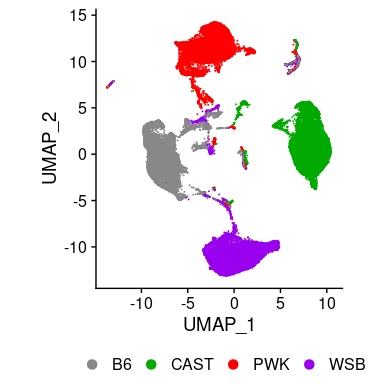
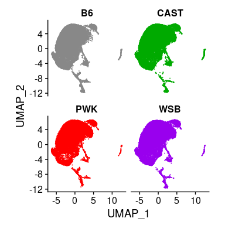
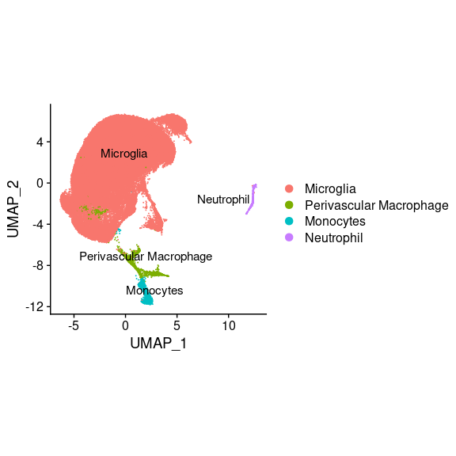
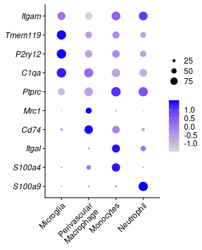

```r
library(tidyverse)
```

```
## ── Attaching packages ─────────────────────────────────────────────── tidyverse 1.3.0 ──
```

```
## ✔ ggplot2 3.2.1     ✔ purrr   0.3.3
## ✔ tibble  2.1.3     ✔ dplyr   0.8.3
## ✔ tidyr   1.0.2     ✔ stringr 1.4.0
## ✔ readr   1.3.1     ✔ forcats 0.4.0
```

```
## ── Conflicts ────────────────────────────────────────────────── tidyverse_conflicts() ──
## ✖ dplyr::filter() masks stats::filter()
## ✖ dplyr::lag()    masks stats::lag()
```

```r
library(cowplot)
```

```
## 
## ********************************************************
```

```
## Note: As of version 1.0.0, cowplot does not change the
```

```
##   default ggplot2 theme anymore. To recover the previous
```

```
##   behavior, execute:
##   theme_set(theme_cowplot())
```

```
## ********************************************************
```

```r
library(Seurat)
```

## Myeloid Cell Clustering before Integration


```r
cd11b.merged <- readRDS("~/code/wild_AD_mic_scRNA/02_data/intermediate_rds/emase29files_merged_raw.rds")
# ribosomal gene
ribo.genes <- grep(pattern = "^Rp[sl][[:digit:]]", x = rownames(cd11b.merged@assays$RNA), value = TRUE)
cd11b.merged$percent.ribo <- PercentageFeatureSet(cd11b.merged, features = ribo.genes)
# collect cells from different strains analysis result
# check script notes from previous step to see which rda to use

input_path <- "../03_results/01a_QC_strains/"

rda_B6 <- file.path(input_path, "B6J/B6J_r2_res06_Meta_Marker.rda")
rda_CAST <- file.path(input_path, "CAST/CAST_r2_res06_Meta_Marker.rda")
rda_PWK <- file.path(input_path, "PWK/PWK_r2_res06_Meta_Marker.rda")
rda_WSB <- file.path(input_path, "WSB/WSB_r2_res06_Meta_Marker.rda")

rda_file <- c(rda_B6, rda_CAST, rda_PWK, rda_WSB)
rda_list <- vector(mode = "list", length = length(rda_file))

for (i in seq_along(rda_list)){
  load(rda_file[[i]])
  rda_list[[i]]=meta %>% rownames_to_column(var = "cell_id")
}

names(rda_list) <- c("B6J", "CAST", "PWK", "WSB")
rda_list %>% map(dim)

# filter out cluster 15 in B6J meta

# check B6J meta data summary
rda_list[["B6J"]] %>% group_by(seurat_clusters) %>% 
  summarise(N=n(), 
            med_nCount_RNA=median(nCount_RNA), 
            med_nFeature_RNA=median(nFeature_RNA), 
            med_percent.mt=median(percent.mt),
            med_percent.ribo=median(percent.ribo))

rda_list[["B6J"]] <- rda_list[["B6J"]] %>% filter(seurat_clusters!=15)

rda_list[["B6J"]] %>% group_by(seurat_clusters) %>% 
  summarise(N=n(), 
            med_nCount_RNA=median(nCount_RNA), 
            med_nFeature_RNA=median(nFeature_RNA), 
            med_percent.mt=median(percent.mt),
            med_percent.ribo=median(percent.ribo))

# collect cell ID: 
cells <- rda_list %>% map_df(~ select(., cell_id)) %>% unlist() %>% unname()

# check the number of the cells
rda_list %>% map(dim) %>% map(~ .[1]) %>% unlist() %>% sum() # 91201 cells
#############code reuse end: 02_integration_from_r2

### perform dimension reduction without integration and plot UMAP
cd11b.merged<- cd11b.merged%>% 
  NormalizeData() %>% 
  FindVariableFeatures(selection.method = "vst", nfeatures = 3000)
cd11b.merged <- ScaleData(cd11b.merged, vars.to.regress = c("batch","percent.mt"))
cd11b.merged <- RunPCA(cd11b.merged, npcs = 30)
cd11b.merged <- RunUMAP(cd11b.merged, reduction = "pca", dims = 1:30)
cd11b.merged <- FindNeighbors(cd11b.merged, reduction = "pca", dims = 1:30)
cd11b.merged <- FindClusters(cd11b.merged, resolution = 0.5)

saveRDS(cd11b.merged, "../02_data/intermediate_rds/03_myeloid_clustering_merged_not_integrated.rds")
```


## Myeloid cell clustering before integration

```r
cd11b.merged <- readRDS("../02_data/intermediate_rds/03_myeloid_clustering_merged_not_integrated.rds")
# change the B6J to B6
cd11b.merged$Strain <- gsub("B6J", "B6", cd11b.merged$Strain)
cd11b.merged$Strain <- factor(cd11b.merged$Strain, levels = c("B6", "CAST", "PWK", "WSB"))

##plot Fig2A

path <- "../03_results/03_myeloid_clustering/"
plot_title="myeloid"

p <- DimPlot(cd11b.merged, reduction = "umap", cols = c("#888888", "#00AA00", "#FF0000", "#9900EE"), label = FALSE, group.by="Strain", pt.size = 0.001) + 
  coord_fixed() + theme(legend.position = "none")
ggsave(paste(path, plot_title, "_DimPlot_unintegrated",  ".png", sep=""), plot=p, units = "in", width = 4, height = 4,  dpi=300)

DimPlot(cd11b.merged, reduction = "umap", cols = c("#888888", "#00AA00", "#FF0000", "#9900EE"), label = FALSE, group.by="Strain", pt.size = 0.001) + 
  coord_fixed() + theme(legend.position = "bottom", legend.direction = "horizontal")
```

<!-- -->

```r
ggsave(paste(path, plot_title, "_DimPlot_unintegrated_H_label",  ".png", sep=""), units = "in", width = 4.2, height = 4,  dpi=300)

rm(cd11b.merged)
```


## Myeloid cell clusters after integration: 


```r
cd11b.integrated <- readRDS("~/code/wild_AD_mic_scRNA/02_data/intermediate_rds/cd11b_integrated_r2.rds")  # i=21 (PCA dim) # j=0.5 (resolution) 

DefaultAssay(cd11b.integrated) <- "RNA"

cd11b.integrated$Strain <- gsub("B6J", "B6", cd11b.integrated$Strain) %>% 
  factor(levels = c("B6", "CAST", "PWK", "WSB"))

path <- "../03_results/03_myeloid_clustering/"
i=21 #(PCA dim) 
j=0.5 #(resolution)

# merged view
DimPlot(cd11b.integrated, reduction = "umap", label = FALSE, group.by="Strain", pt.size = 0.001,
        cols = c("#888888", "#00AA00", "#FF0000", "#9900EE")) + coord_fixed() + theme(legend.position = "none")
```

<!-- -->

```r
plot_title="myeloid_integrated"
ggsave(paste(path, plot_title, "_", "pca_", i, "_res_", j, "_DimPlot_Strain",  ".png", sep=""), units = "in", width = 4, height = 4,  dpi=300)

# split view 
DimPlot(cd11b.integrated, reduction = "umap", split.by="Strain", group.by= "Strain", 
              cols = c("#888888", "#00AA00", "#FF0000", "#9900EE"),label = FALSE, pt.size = 0.001, ncol=2) +
  coord_fixed() + theme(legend.position = "none")
```

<!-- -->

```r
plot_title="myeloid_integrated"
ggsave(paste(path, plot_title, "_", "pca_", i, "_res_", j, "_DimPlot_Strain_split",  ".png", sep=""), units = "in", width = 4, height = 4,  dpi=300)
```

## Myeloid Cell Annotation

### UMAP plot

```r
sum_table <- cd11b.integrated@meta.data %>% group_by(seurat_clusters) %>% summarise(N=n(), median_nCount_RNA=median(nCount_RNA), median_nFeature_RNA=median(nFeature_RNA), median_percent.mt=median(percent.mt))

percent_table <- mutate(sum_table, percent_cells=N/sum(N)*100)

percent_mg <- sum_table$N %>% .[1:12] %>% sum()/sum_table$N %>% sum()

# DimPlot(cd11b.integrated, reduction = "umap", label = TRUE, pt.size = 0.001) + NoLegend() + coord_fixed()
# Merge cluster 0 to 11 into microglia

cd11b.integrated$cell_type <-  ifelse(cd11b.integrated$seurat_clusters %in% 0:11,"Microglia",
                                      cd11b.integrated$seurat_clusters %>% as.character())

cd11b.integrated$cell_type <- factor(cd11b.integrated$cell_type, 
                                     levels = c("Microglia", "12", "13", "14"),
                                     labels = c("Microglia", "Perivascular Macrophage", "Monocytes", "Neutrophil"))
                                    
Idents(cd11b.integrated) <- "cell_type"

plot_title="UMAP_myeloid_annotation_label.png" 
DimPlot(cd11b.integrated, reduction = "umap", label = TRUE, repel = TRUE, pt.size = 0.001) + coord_fixed() +
  theme(legend.position = "right")
```

```
## Warning: Using `as.character()` on a quosure is deprecated as of rlang 0.3.0.
## Please use `as_label()` or `as_name()` instead.
## This warning is displayed once per session.
```

<!-- -->

```r
ggsave(file.path(path, plot_title), units = "in", width = 6, height = 4, dpi=300)

plot_title="UMAP_myeloid_annotation_no_label.png" 
p <- DimPlot(cd11b.integrated, reduction = "umap", label = FALSE, repel = TRUE, pt.size = 0.001) + coord_fixed()+ NoLegend()
ggsave(file.path(path, plot_title), p, units = "in", width = 4, height = 4, dpi=300)
```

### Dot plot

```r
genes <- c("Itgam", "Tmem119", "P2ry12",  "C1qa", "Ptprc", "Mrc1", "Cd74", "Itgal", "S100a4", "S100a9")
## Signiture genes to distinguish different sets of myeloid cells

DotPlot(cd11b.integrated, features = genes) + RotatedAxis() + 
  theme(axis.title = element_blank(), 
        legend.title = element_blank(), 
        axis.text.y = element_text(face = "italic")) + 
  scale_y_discrete(labels = function(x) str_wrap(x, width = 20)) + 
  coord_flip() 
```

<!-- -->

```r
plot_title <- "Myeloid_dotplot.png"
ggsave(file.path(path, plot_title), units = "in", width = 4.2, height = 5.2, dpi=300)
plot_title <- "Myeloid_dotplot_small.png"
ggsave(file.path(path, plot_title), units = "in", width = 3.7, height = 3.7, dpi=300)
```

### UMAP plot featuring genes that distinguish subsets of myeloid cells


```r
####run for single gene
# FeaturePlot(cd11b.integrated, features = "Mrc1", min.cutoff = "q9",label=FALSE, order=TRUE) + 
#   coord_fixed() + 
#   theme(axis.title = element_blank(),
#         axis.line = element_blank(),
#         axis.text = element_blank(),
#         axis.ticks = element_blank())

### Plot 6 genes together
genes <- c("Tmem119", "P2ry12", "Mrc1", "Cd74", "Itgal", "S100a9")
p <- genes %>% 
  map(~FeaturePlot(cd11b.integrated, features = ., min.cutoff = "q9",label=FALSE, order = TRUE) + 
        coord_fixed() + 
        theme(axis.title = element_blank(),
              axis.line = element_blank(),
              axis.text = element_blank(),
              axis.ticks = element_blank())
  )

## plot into one figure
plot_grid(p[[1]], p[[2]], p[[3]], p[[4]], p[[5]], p[[6]], align = ("hv"), nrow =2, ncol =3)
```

<!-- -->

```r
ggsave(paste(path, "Feature_plot_all.png", sep=""), units = "in", width = 12, height = 8,  dpi=300)
```


