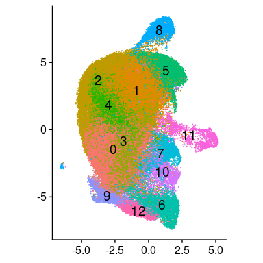
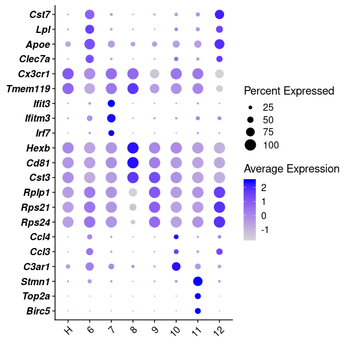
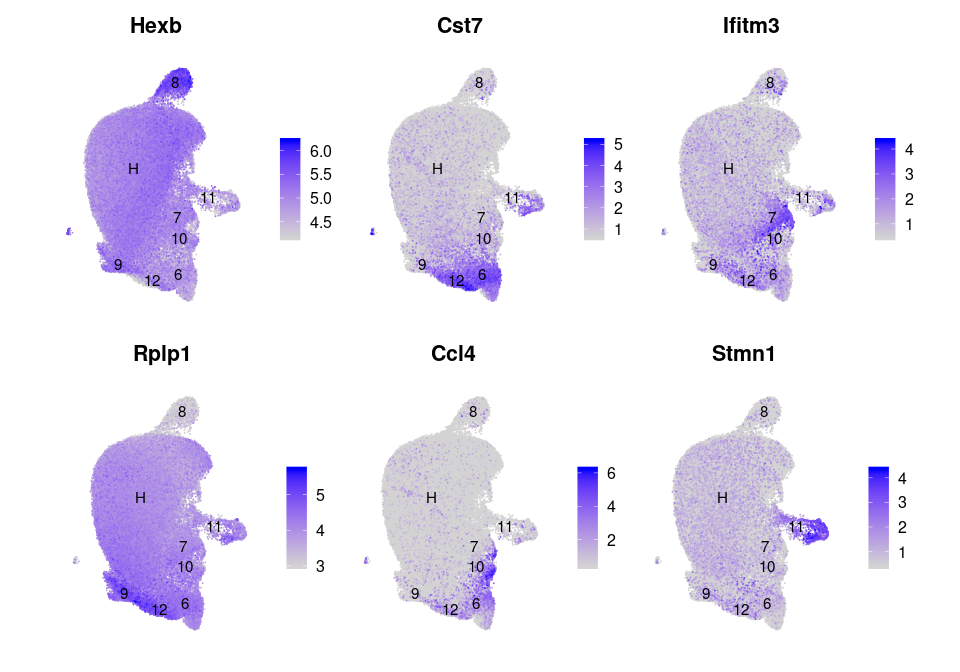
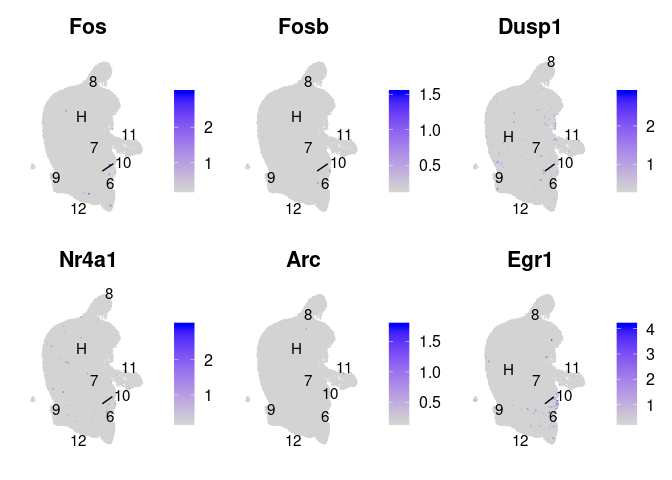
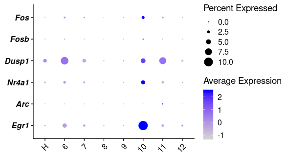
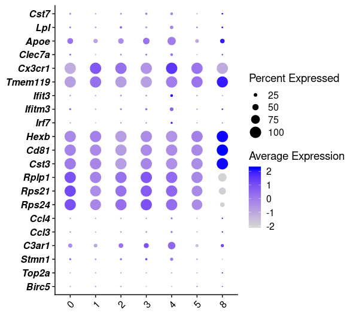
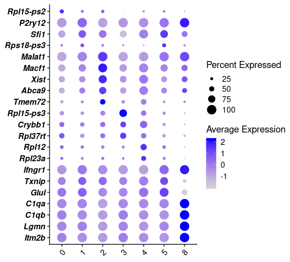
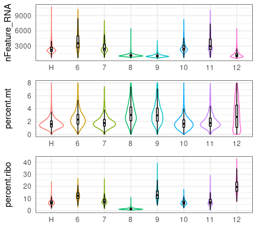

```r
library(tidyverse)
library(cowplot)
library(Seurat)
library(patchwork)
```

## Load microglia object


```r
cd11b.integrated <- readRDS("../02_data/intermediate_rds/mg_int.rds") 

DefaultAssay(cd11b.integrated) <- "RNA"
cd11b.integrated@meta.data %>% group_by(Strain, Genotype) %>% summarise(N=n())
```

```
## # A tibble: 8 x 3
## # Groups:   Strain [4]
##   Strain Genotype     N
##   <chr>  <chr>    <int>
## 1 B6J    APP/PS1  11531
## 2 B6J    WT        9201
## 3 CAST   APP/PS1   9232
## 4 CAST   WT       14892
## 5 PWK    APP/PS1   7906
## 6 PWK    WT       11796
## 7 WSB    APP/PS1  14425
## 8 WSB    WT        8763
```

```r
cd11b.integrated$Strain <- str_replace_all(cd11b.integrated$Strain, pattern = "B6J", replacement = "B6")
cd11b.integrated$Group <- str_replace_all(cd11b.integrated$Group, pattern = "B6J", replacement = "B6")
cd11b.integrated$Group <- factor(cd11b.integrated$Group, levels = c("B6_WT","B6_APP/PS1","CAST_WT", "CAST_APP/PS1", 
                                                                    "PWK_WT",  "PWK_APP/PS1", "WSB_WT", "WSB_APP/PS1"))
sum_table <- cd11b.integrated@meta.data %>% group_by(seurat_clusters) %>% summarise(N=n(), ave_nCount_RNA=median(nCount_RNA), ave_nFeature_RNA=median(nFeature_RNA), ave_percent.mt=median(percent.mt))
prop.table(table(Idents(cd11b.integrated), cd11b.integrated$Group), margin = 2)
```

```
##     
##            B6_WT  B6_APP/PS1     CAST_WT CAST_APP/PS1      PWK_WT
##   0  0.230301054 0.194605845 0.234286865  0.193349220 0.152085453
##   1  0.138571894 0.113780245 0.266317486  0.177426343 0.327399118
##   2  0.223453972 0.124186974 0.158340048  0.102794627 0.131230926
##   3  0.177263341 0.149770185 0.095151759  0.104961005 0.061291963
##   4  0.087273122 0.068164079 0.047542305  0.018847487 0.103001017
##   5  0.006086295 0.003555633 0.087362342  0.042352686 0.120803662
##   6  0.007064450 0.128436389 0.005170561  0.172010399 0.001695490
##   7  0.052711662 0.055502558 0.014773033  0.030545927 0.016022380
##   8  0.017172047 0.018298500 0.026792909  0.017872617 0.024499830
##   9  0.021519400 0.026276992 0.016183186  0.015706239 0.033316378
##   10 0.019671775 0.036163386 0.022696750  0.025671577 0.019582909
##   11 0.016193892 0.031133466 0.023502552  0.035745234 0.008053577
##   12 0.002717096 0.050125748 0.001880204  0.062716638 0.001017294
##     
##      PWK_APP/PS1      WSB_WT WSB_APP/PS1
##   0  0.180369340 0.193769257 0.259896014
##   1  0.144194283 0.226292366 0.212478336
##   2  0.099418163 0.095971699 0.066828423
##   3  0.033392360 0.130320666 0.103570191
##   4  0.111307867 0.070295561 0.066620451
##   5  0.071211738 0.068013237 0.080623917
##   6  0.078800911 0.014835102 0.047209705
##   7  0.084745763 0.017459774 0.029254766
##   8  0.049203137 0.112746776 0.023986135
##   9  0.051479889 0.027958462 0.037781629
##   10 0.024791298 0.022252653 0.030641248
##   11 0.017961042 0.015748031 0.025303293
##   12 0.053124209 0.004336414 0.015805893
```


```r
Idents(cd11b.integrated) <- "seurat_clusters"

path <- "../03_results/04a_microglia_clustering/"
plot_title="mic_cluster"
i=17 #(PCA dim) 
j=0.6 #(resolution)
```

## UMAP plot

### UMAP plot - strain/genotype combined


```r
DimPlot(cd11b.integrated, reduction = "umap", label = TRUE, pt.size = 0.001, label.size = 5) + 
  coord_fixed()+
  theme(axis.title = element_blank(), legend.position = "none")
```

```
## Warning: Using `as.character()` on a quosure is deprecated as of rlang 0.3.0.
## Please use `as_label()` or `as_name()` instead.
## This warning is displayed once per session.
```

<!-- -->

```r
ggsave(paste(path, plot_title, "_", "umap_", i, "_res_", j, "_DimPlot_Strain_small",  ".png", sep=""), units = "in", width = 4, height = 4,  dpi=300)
```


## check marker genes of each cluster, list top 10 marker genes


```r
load("../03_results/01c_integration_mg/pca_res_search/int_mg_pca_17_res_0.6_markers_proptbl.rda")
cd11b.markers %>% group_by(cluster) %>%  top_n(-10, wt=p_val_adj)
```

```
## # A tibble: 116 x 7
## # Groups:   cluster [13]
##       p_val avg_logFC pct.1 pct.2 p_val_adj cluster gene     
##       <dbl>     <dbl> <dbl> <dbl>     <dbl> <fct>   <chr>    
##  1 3.90e- 3     0.478 0.383 0.199  1.00e+ 0 0       Rpl15-ps2
##  2 1.03e- 9     0.255 0.996 0.947  4.89e- 5 1       Gm37376  
##  3 2.05e- 8     0.263 1     0.99   9.75e- 4 1       P2ry12   
##  4 3.45e- 5     0.269 0.786 0.725  1.00e+ 0 1       Sfi1     
##  5 9.48e- 4     0.272 0.33  0.191  1.00e+ 0 1       Rps18-ps3
##  6 4.87e-36     0.505 1     0.96   2.32e-31 2       Malat1   
##  7 1.12e-28     0.470 0.989 0.911  5.32e-24 2       Gm26905  
##  8 9.30e-28     0.832 0.785 0.484  4.43e-23 2       Gm17131  
##  9 2.29e-24     0.537 0.937 0.76   1.09e-19 2       Macf1    
## 10 7.14e-22     0.615 0.858 0.6    3.40e-17 2       Gm42519  
## # … with 106 more rows
```

## combine homeostatic microglia


```r
cd11b.integrated$final_clusters <-  ifelse(cd11b.integrated$seurat_clusters %in% 0:5,"H",
                                           cd11b.integrated$seurat_clusters %>% as.character())
cd11b.integrated$final_clusters <- factor(cd11b.integrated$final_clusters, 
                                          levels = c("H", "6", "7", "8", "9", "10", "11", "12"))
Idents(cd11b.integrated) <- "final_clusters"
```


```r
cd11b.markers_new <- FindAllMarkers(cd11b.integrated, only.pos = FALSE, min.pct = 0.2, logfc.threshold = 0.25, max.cells.per.ident=500) #max.cells.per.ident
saveRDS(cd11b.markers_new, file = paste(path, "mg_markers_new.rds", sep=""))

# get rid of ribo genes in marker genes
ribo.genes <- grep(pattern = "^Rp[sl][[:digit:]]", x = rownames(cd11b.integrated@assays$RNA), value = TRUE)
cd11b.markers <- filter(cd11b.markers, !gene %in% ribo.genes)
```


```r
cd11b.markers_new <- readRDS(paste(path, "mg_markers_new.rds", sep=""))
cd11b.markers_new <- cd11b.markers_new %>% mutate(gene=paste(" ", gene, sep = ""))
write_delim(cd11b.markers_new, paste(path, "mg_markers_new.txt", sep = ""), delim = "\t")
top_20 <- cd11b.markers_new %>% group_by(cluster) %>% filter(avg_logFC>0.3) %>% top_n(20, wt = avg_logFC)
top_20
```

```
## # A tibble: 160 x 7
## # Groups:   cluster [8]
##       p_val avg_logFC pct.1 pct.2 p_val_adj cluster gene     
##       <dbl>     <dbl> <dbl> <dbl>     <dbl> <fct>   <chr>    
##  1 1.22e-38     0.441 1     0.942  5.82e-34 H       " Cx3cr1"
##  2 1.65e-37     0.404 0.998 0.931  7.84e-33 H       " Marcks"
##  3 1.62e-35     0.494 0.941 0.723  7.72e-31 H       " Zfhx3" 
##  4 1.31e-29     0.429 0.999 0.844  6.23e-25 H       " Malat1"
##  5 4.75e-27     0.432 0.888 0.664  2.26e-22 H       " Nrip1" 
##  6 9.32e-27     0.441 0.892 0.676  4.44e-22 H       " Maf"   
##  7 3.32e-26     0.464 0.848 0.627  1.58e-21 H       " Txnip" 
##  8 1.86e-23     0.404 0.93  0.714  8.88e-19 H       " Ssh2"  
##  9 4.28e-22     0.438 0.908 0.7    2.04e-17 H       " Srgap2"
## 10 1.36e-21     0.415 0.9   0.669  6.49e-17 H       " Pnisr" 
## # … with 150 more rows
```

```r
### Marks for DAM-1, DAM-2
### vilin plot: Cst7, Lpl, Apoe, Clec7a, Cx3cr1
### FeaturePlot: Cst7

### Marks for IRM
### vilin plot: Ifit3, Ifitm3, Irf7
### FeaturePlot: Ifit3

### Marks for Hexb-high cells
### vilin plot: Hexb, Cd81, Cst3
### FeaturePlot: Hexb


### Marks for Ribosomal-gene-enriched cells
### vilin plot: Rplp1, Rps21, Rps24
### FeaturePlot: Rplp1

### Marks for Ccl3/Ccl4+ cells
### vilin plot: Ccl3, Ccl4, C3ar1
### FeaturePlot: Ccl3


### Marks for proliferative microglia
### vilin plot: Stmn1, Top2a, Birc5
### FeaturePlot: Stmn1
```
### UMAP plot - strain/genotype splitted


```r
Idents(cd11b.integrated) <- "final_clusters"

p <- DimPlot(cd11b.integrated, reduction = "umap", label = TRUE, pt.size = 1E-10, split.by = "Group", ncol = 2, label.size = 3, repel = TRUE) + 
  coord_fixed()+
  theme(text = element_blank(), legend.position = "none")
ggsave(paste(path, plot_title, "_", "umap_", i, "_res_", j, "_DimPlot_Strain_split_no_text",  ".png", sep=""), p, units = "in", width = 3, height = 5.7,  dpi=300)

DimPlot(cd11b.integrated, reduction = "umap", label = TRUE, pt.size = 1E-10, split.by = "Group", ncol = 2, label.size = 3, repel = TRUE) + 
  coord_fixed()+
  theme(title = element_text(size = 3), 
        axis.text = element_text(size = 6),
        legend.position = "none")
```

<!-- -->

## Dot plot of microglia marker genes for each clusters


```r
Idents(cd11b.integrated) <- "final_clusters"

genes <- c("Cst7", "Lpl", "Apoe", "Clec7a", "Cx3cr1", "Tmem119", "Ifit3", "Ifitm3", "Irf7", "Hexb", "Cd81", "Cst3", "Rplp1", "Rps21", "Rps24", "Ccl4", "Ccl3", "C3ar1", "Stmn1", "Top2a", "Birc5")

file_name <- paste(path, "Dotplot_all_gene_H_combine.png", sep = "")
DotPlot(cd11b.integrated, features = genes) + RotatedAxis() + 
  theme(axis.title = element_blank()) + 
  scale_y_discrete(labels = function(x) str_wrap(x, width = 20)) + 
  coord_flip() + 
  theme(axis.text.y = element_text(face = "bold.italic"))
```

<!-- -->

```r
ggsave(file_name ,units = "in", width = 5.5, height = 5.5, dpi=300)
```

## Feature plots of marker genes of microglia subclusters

```r
genes <- c("Hexb", "Cst7", "Ifitm3", "Rplp1", "Ccl4", "Stmn1")

# # plot one gene
# FeaturePlot(cd11b.integrated, features = c("Tmem119"), min.cutoff = "q9",label=TRUE, repel = FALSE, ncol = 2, order = TRUE) + 
#   coord_fixed() +
#   theme(axis.line = element_blank(), 
#         axis.title = element_blank(),
#         axis.text = element_blank(),
#         axis.ticks = element_blank())

p <- genes %>% 
  map(~FeaturePlot(cd11b.integrated, features = ., min.cutoff = "q9",label=TRUE, repel = FALSE, ncol = 2, order = TRUE) + 
        coord_fixed() +
        theme(axis.line = element_blank(), 
              axis.title = element_blank(),
              axis.text = element_blank(),
              axis.ticks = element_blank())
  )

(p[[1]]+p[[2]]+p[[3]])/(p[[4]]+p[[5]]+p[[6]])
```

<!-- -->

```r
ggsave(paste(path, "Feature_plot_all.png", sep=""), units = "in", width = 10, height = 7,  dpi=300)
```

## Check immediate early  genes (IEG)

#### To verify that our microglia prepared by mechniacal dissociation at 4 °C were not globally ex vivo activated

### Feature plots for IEG

```r
genes <- c("Fos", "Fosb", "Dusp1", "Nr4a1", "Arc", "Egr1")

# FeaturePlot(cd11b.integrated, features = c("Egr1"), split.by = "Genotype", min.cutoff = "q9",label=TRUE, repel = TRUE, ncol = 2, order=TRUE) # + coord_fixed()

p <- genes %>% 
  map(~FeaturePlot(cd11b.integrated, features = ., min.cutoff = "q9",label=TRUE, repel = TRUE, ncol = 2, order=FALSE) + 
        coord_fixed()+
        theme(axis.line = element_blank(), 
              axis.title = element_blank(),
              axis.text = element_blank(),
              axis.ticks = element_blank()
        )
  )

(p[[1]]+p[[2]]+p[[3]])/(p[[4]]+p[[5]]+p[[6]])
```

<!-- -->

```r
ggsave(paste(path, "Feature_plot_all_unordered.png", sep=""), units = "in", width = 10, height = 7,  dpi=300)
```

### Dot plot for IEG

```r
DotPlot(cd11b.integrated, features = genes) + RotatedAxis() + 
  theme(axis.title = element_blank(),
        axis.text.y = element_text(face = "bold.italic")) + 
  scale_y_discrete(labels = function(x) str_wrap(x, width = 20)) + 
  coord_flip() 
```

<!-- -->

```r
ggsave(paste(path, "Dotplot_IEG.png", sep = ""),units = "in", width = 6.1, height = 3.4, dpi=300)
```

## Deeper dive into homeostatic microglia subclusters

### Dot plot showing other activated microlgia marker genes (cluster 6-12) in homeostatic microglia subclusters are not quite different


```r
Idents(cd11b.integrated) <- "seurat_clusters"

genes <- c("Cst7", "Lpl", "Apoe", "Clec7a", "Cx3cr1", "Tmem119", "Ifit3", "Ifitm3", "Irf7", "Hexb", "Cd81", "Cst3", "Rplp1", "Rps21", "Rps24", "Ccl4", "Ccl3", "C3ar1", "Stmn1", "Top2a", "Birc5")

DotPlot(cd11b.integrated %>% subset(idents = c(0:5, 8)), features = genes) + RotatedAxis() + 
  theme(axis.title = element_blank(),
        axis.text.y = element_text(face = "bold.italic")) + 
  scale_y_discrete(labels = function(x) str_wrap(x, width = 20)) + 
  coord_flip() 
```

<!-- -->

```r
ggsave(paste(path, "Dotplot_all_gene_homeo.png", sep = "") ,units = "in", width = 6.1, height = 5.5, dpi=300)
paste(path, "Dotplot_all_gene_homeo.png", sep = "")
```

```
## [1] "../03_results/04a_microglia_clustering/Dotplot_all_gene_homeo.png"
```

```r
### Marks for homeostatic sub microlgia: 
#0 Rpl15-ps2
#1 P2ry12, Sfi1, Rps18-ps3
#2 Malat1, Macf1, Xist, Abca9, Tmem72
#3 Rpl15-ps3, Crybb1, Rpl37rt
#4 Rpl12, Rpl23a
#5 Ifngr1, Txnip, Glul
#8 C1qa, C1qb, Lgmn
```

### Dot plot showing top marker genes in homeostatic microglia subclusters are mostly ribosomal genes or pseudogenes


```r
genes_homeo <- c("Rpl15-ps2","P2ry12", "Sfi1", "Rps18-ps3", "Malat1", "Macf1", "Xist", "Abca9", "Tmem72",
           "Rpl15-ps3", "Crybb1", "Rpl37rt", "Rpl12", "Rpl23a", "Ifngr1", "Txnip", "Glul", 
           "C1qa", "C1qb", "Lgmn", "Itm2b")
                                                        
DotPlot(cd11b.integrated %>% subset(idents = c(0:5, 8)), features = genes_homeo) + RotatedAxis() + 
  theme(axis.title = element_blank(),
        axis.text.y = element_text(face = "bold.italic")) + 
  scale_y_discrete(labels = function(x) str_wrap(x, width = 20)) + 
  coord_flip() 
```

<!-- -->

```r
ggsave(paste(path, "Dotplot_all_gene_homeo2.png") ,units = "in", width = 6.1, height = 5.5, dpi=300)
```

## Check the gene number, percent of ribosomal genes and percent of mitochodrial genes in each cluster


```r
QC_plot_single2 <-function(data, y){
  p <- ggplot(data, aes_string(x="final_clusters", y=y, color= "final_clusters")) +
    geom_violin() +
    geom_boxplot(width=0.07, outlier.shape = NA, color = "black", alpha=0.7) +
    theme_bw()+
    theme(legend.position = "none", axis.title.x = element_blank(), axis.ticks = element_blank())
  return(p)
}

p_QC <- c("nFeature_RNA", "percent.mt", "percent.ribo") %>% map(~QC_plot_single2(cd11b.integrated@meta.data, .))

p <- plot_grid(plotlist=p_QC, nrow=3, ncol = 1, align="hv")
plot_grid(p, nrow=1, rel_heights=c(0.1, 1))
```

<!-- -->

```r
ggsave(paste(path, "all_microglia_integrated2.png", sep=""), units = "in", width = 4.5, height = 3.5,  dpi=300)
```


