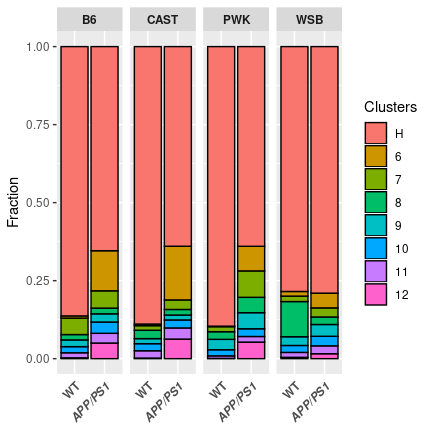
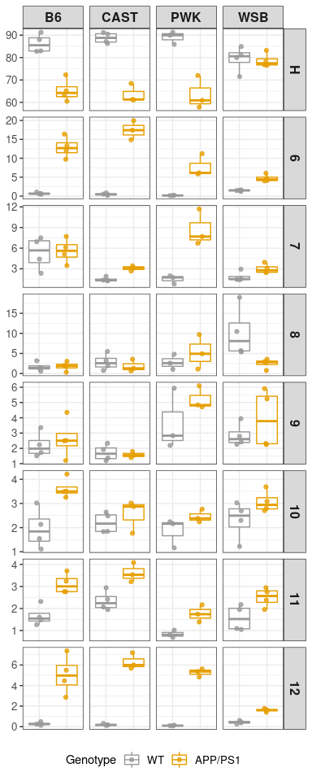

```r
library(tidyverse)
library(cowplot)
library(Seurat)

path = "../03_results/04b_microglia_statistics/"
```

### Load object

```r
cd11b.integrated <- readRDS("../02_data/intermediate_rds/mg_int.rds")  # i=17 (PCA dim) # j=0.6 (resolution)

DefaultAssay(cd11b.integrated) <- "RNA"
cd11b.integrated@meta.data %>% group_by(Strain, Genotype) %>% summarise(N=n())
```

```
## # A tibble: 8 x 3
## # Groups:   Strain [4]
##   Strain Genotype     N
##   <chr>  <chr>    <int>
## 1 B6J    APP/PS1  11531
## 2 B6J    WT        9201
## 3 CAST   APP/PS1   9232
## 4 CAST   WT       14892
## 5 PWK    APP/PS1   7906
## 6 PWK    WT       11796
## 7 WSB    APP/PS1  14425
## 8 WSB    WT        8763
```

```r
cd11b.integrated$Strain <- str_replace_all(cd11b.integrated$Strain, pattern = "B6J", replacement = "B6")
cd11b.integrated$Group <- str_replace_all(cd11b.integrated$Group, pattern = "B6J", replacement = "B6")
cd11b.integrated$Group <- factor(cd11b.integrated$Group, levels = c("B6_WT","B6_APP/PS1","CAST_WT", "CAST_APP/PS1",
                                                                    "PWK_WT",  "PWK_APP/PS1", "WSB_WT", "WSB_APP/PS1"))
cd11b.integrated$batch <- factor(cd11b.integrated$batch, levels = c("D", "C", "B", "A"))


sum_table <- cd11b.integrated@meta.data %>% group_by(seurat_clusters) %>% summarise(N=n(), ave_nCount_RNA=median(nCount_RNA), ave_nFeature_RNA=median(nFeature_RNA), ave_percent.mt=median(percent.mt))
prop.table(table(Idents(cd11b.integrated), cd11b.integrated$Group), margin = 2)
```

```
##     
##            B6_WT  B6_APP/PS1     CAST_WT CAST_APP/PS1      PWK_WT
##   0  0.230301054 0.194605845 0.234286865  0.193349220 0.152085453
##   1  0.138571894 0.113780245 0.266317486  0.177426343 0.327399118
##   2  0.223453972 0.124186974 0.158340048  0.102794627 0.131230926
##   3  0.177263341 0.149770185 0.095151759  0.104961005 0.061291963
##   4  0.087273122 0.068164079 0.047542305  0.018847487 0.103001017
##   5  0.006086295 0.003555633 0.087362342  0.042352686 0.120803662
##   6  0.007064450 0.128436389 0.005170561  0.172010399 0.001695490
##   7  0.052711662 0.055502558 0.014773033  0.030545927 0.016022380
##   8  0.017172047 0.018298500 0.026792909  0.017872617 0.024499830
##   9  0.021519400 0.026276992 0.016183186  0.015706239 0.033316378
##   10 0.019671775 0.036163386 0.022696750  0.025671577 0.019582909
##   11 0.016193892 0.031133466 0.023502552  0.035745234 0.008053577
##   12 0.002717096 0.050125748 0.001880204  0.062716638 0.001017294
##     
##      PWK_APP/PS1      WSB_WT WSB_APP/PS1
##   0  0.180369340 0.193769257 0.259896014
##   1  0.144194283 0.226292366 0.212478336
##   2  0.099418163 0.095971699 0.066828423
##   3  0.033392360 0.130320666 0.103570191
##   4  0.111307867 0.070295561 0.066620451
##   5  0.071211738 0.068013237 0.080623917
##   6  0.078800911 0.014835102 0.047209705
##   7  0.084745763 0.017459774 0.029254766
##   8  0.049203137 0.112746776 0.023986135
##   9  0.051479889 0.027958462 0.037781629
##   10 0.024791298 0.022252653 0.030641248
##   11 0.017961042 0.015748031 0.025303293
##   12 0.053124209 0.004336414 0.015805893
```

### plot both genotypes in all strains (all replicates combined)

```r
# generate meta data, combine cluster 0-5 into H for fraction plot (all replicates combined)
cd11b.meta <- cd11b.integrated@meta.data %>% 
  mutate(Genotype=factor(Genotype, levels=c("WT", "APP/PS1")),
         Strain=factor(Strain, levels = c("B6", "CAST", "PWK", "WSB")),
         new_clusters=ifelse(seurat_clusters %in% 0:5, "H", as.character(seurat_clusters)),
         new_clusters=factor(new_clusters, levels = c("H", "6", "7", "8", "9", "10", "11", "12"))) %>% 
  group_by(Strain, Genotype,new_clusters) %>% 
  summarise(N=n())

ggplot(cd11b.meta, aes(y=N, x=Genotype, fill= new_clusters)) + 
  geom_bar(stat="identity", position="fill", color="black") + 
  labs(y="Fraction", fill = "Clusters") +
  facet_grid(~ Strain) +
  theme(axis.text.x = element_text(angle = 45, hjust = 1, face = c("bold", "bold.italic")),
        axis.title.x = element_blank(), 
        strip.text.x = element_text(face = "bold"), 
        axis.ticks.x = element_blank(), 
        axis.line.x = element_blank())
```

<!-- -->

```r
ggsave(paste(path, "fraction_WT_APPPS1.png", sep=""), width = 4.5, height = 4.5, units = "in")
```

### plot both genotypes in all strains (all replicates separated)

```r
### generate meta data, combine cluster 0-5 into H for fraction plot (all replicates separated)
cd11b.meta <- cd11b.integrated@meta.data %>% 
  mutate(Genotype=factor(Genotype, levels=c("WT", "APP/PS1")),
         Strain=factor(Strain, levels = c("B6", "CAST", "PWK", "WSB")),
         new_clusters=ifelse(seurat_clusters %in% 0:5, "H", as.character(seurat_clusters)),
         new_clusters=factor(new_clusters, levels = c("H", "6", "7", "8", "9", "10", "11", "12"))) %>% 
  group_by(rep, Strain, Genotype, Group, batch, new_clusters) %>% 
  arrange(Group) %>%
  summarise(N=n())

p <- ggplot(cd11b.meta, aes(y=N, x=batch, fill= new_clusters)) + 
  geom_bar(stat="identity", position=position_fill(), color="black") + 
  labs(y="Fraction", fill = "Clusters") +
  facet_grid(Group~., switch="y")+
  coord_flip()+
  theme(axis.text = element_blank(),
        axis.title = element_blank(), 
        strip.text = element_blank(), 
        axis.ticks.y = element_blank(), 
        axis.line.y = element_blank(), 
        legend.position = "none")
ggsave(paste(path, "fraction_replicates_seperated.png", sep=""), p, width = 3.5, height = 5, units = "in")

# top to bottome: "B6_WT","B6_APP/PS1","CAST_WT", "CAST_APP/PS1", "PWK_WT",  "PWK_APP/PS1", "WSB_WT", "WSB_APP/PS1"
```

### Box plot for all microglia
#### generate meta data, combine cluster 0-5 into H for statistical testing and box plot

```r
cd11b.meta.stat <- cd11b.integrated@meta.data %>% 
  mutate(Genotype=factor(Genotype, levels=c("WT", "APP/PS1")),
         Strain=factor(Strain, levels = c("B6", "CAST", "PWK", "WSB")),
         new_clusters=ifelse(seurat_clusters %in% 0:5, "H", as.character(seurat_clusters)),
         new_clusters=factor(new_clusters, levels = c("H", "6", "7", "8", "9", "10", "11", "12"))) %>% 
  group_by(Strain, Genotype,rep, new_clusters) %>% 
  summarise(Med_nFeature=median(nFeature_RNA), 
            Med_percent_mt=median(percent.mt), 
            Med_percent_ribo=median(percent.ribo),
            N=n()) %>% 
  group_by(rep,Percent=N/sum(N)*100)
```


```r
cbPalette <- c("#999999", "#E69F00", "#56B4E9", "#009E73", "#F0E442", "#0072B2", "#D55E00", "#CC79A7")

cd11b.meta.stat %>%
  ggplot(aes(y=Percent, x=Genotype, color=Genotype)) +
  geom_boxplot(outlier.size = 0, alpha=0.5) +
  geom_point(aes(color=Genotype), position=position_jitterdodge(), alpha=0.8) + 
  scale_colour_manual(values=cbPalette) + 
  theme_bw() +
  facet_grid(new_clusters ~ Strain, scales= "free_y")+
  theme(axis.text.x = element_blank(),
        axis.text.y = element_text(size = 10),
        legend.text = element_text(size = 10),
        strip.text = element_text(face = "bold", size = 12), 
        axis.ticks.x = element_blank(), 
        axis.title= element_blank(), 
        #legend.text = element_text(face = c("plain", "italic")),
        legend.position = "bottom")
```

<!-- -->

```r
ggsave(paste(path, "cluster_box_all.png", sep=""), width = 4, height = 10, units = "in")
```

### Perform two-way ANOVA to determine the effect of strain and genotype on the percent of micrglia subclusters 

```r
####single function for stain and GT interaction debugging

clusters <- unique(cd11b.meta.stat$new_clusters) %>% as.list()

data = cd11b.meta.stat %>% filter(new_clusters %in% clusters[[1]])
aov_object = aov(Percent ~ Strain*Genotype , data=data)
aov.pvals = summary(aov_object)
aov.pvals= aov.pvals[[1]][5] %>% t() %>% as.data.frame()
names(aov.pvals) <- c("Strain", "Genotype", "Strain_Genotype", "Residuals")
aov.pvals <- aov.pvals %>% 
  select(-Residuals) %>% 
  mutate(Cluster = clusters[1] %>% as.character())

aov_StrainGT <- function(cluster, data){
  data = data %>% filter(new_clusters %in% cluster)
  aov_object = aov(Percent ~ Strain*Genotype, data=data)
  aov.pvals = summary(aov_object)
  aov.pvals= aov.pvals[[1]][5] %>% t() %>% as.data.frame()
  names(aov.pvals) <- c("Strain", "Genotype", "Strain_Genotype", "Residuals")
  aov.pvals <- aov.pvals %>% 
    select(-Residuals) %>% 
    mutate(Cluster = cluster %>% as.character())
  return(aov.pvals)
}

aov_StrainGT_object <- function(cluster, data){
  data = data %>% filter(new_clusters %in% cluster)
  aov_object = aov(Percent ~ Strain*Genotype, data=data)
  return(aov_object)
}

aov_StrainGT_table <- clusters %>% map_df(aov_StrainGT, data=cd11b.meta.stat)
aov_StrainGT_table <- aov_StrainGT_table %>% mutate_if(is.double, p.adjust)

aov_StrainGT_table$Cluster[aov_StrainGT_table$Strain_Genotype<0.05]
```

```
## [1] "H"  "6"  "7"  "12"
```

```r
# [1] "H"  "6"  "7"  "12"

aov_StrainGT_table$Cluster[aov_StrainGT_table$Strain<0.05]
```

```
## [1] "6"  "7"  "9"  "11" "12"
```

```r
# [1] "6"  "7"  "9" "11" "12" 

aov_StrainGT_table$Cluster[aov_StrainGT_table$Genotype<0.05]
```

```
## [1] "H"  "6"  "7"  "10" "11" "12"
```

```r
# [1] "6"  "7"  "H" "10" "11" "12"

# keep the annova object for  
aov_object_list <- clusters %>% map(aov_StrainGT_object, data=cd11b.meta.stat)
names(aov_object_list) <- clusters %>% unlist()
TukeyHSD(aov_object_list[["H"]]) %>% .$`Strain:Genotype` %>% data.frame(.,cluster="H")
```

```
##                                  diff        lwr         upr        p.adj
## CAST:WT-B6:WT              2.50564568  -8.247699  13.2589902 9.923753e-01
## PWK:WT-B6:WT               2.80327785  -8.811662  14.4182175 9.906220e-01
## WSB:WT-B6:WT              -6.85282267 -17.606167   3.9005219 4.246406e-01
## B6:APP/PS1-B6:WT         -20.94042199 -31.693767 -10.1870774 4.244607e-05
## CAST:APP/PS1-B6:WT       -22.62731099 -34.242251 -11.0123714 4.220632e-05
## PWK:APP/PS1-B6:WT        -22.67043094 -34.285371 -11.0554913 4.108533e-05
## WSB:APP/PS1-B6:WT         -7.57961006 -18.332955   3.1737345 3.075124e-01
## PWK:WT-CAST:WT             0.29763217 -11.317307  11.9125718 1.000000e+00
## WSB:WT-CAST:WT            -9.35846835 -20.111813   1.3948762 1.185954e-01
## B6:APP/PS1-CAST:WT       -23.44606767 -34.199412 -12.6927231 8.110079e-06
## CAST:APP/PS1-CAST:WT     -25.13295668 -36.747896 -13.5180171 9.096957e-06
## PWK:APP/PS1-CAST:WT      -25.17607662 -36.791016 -13.5611370 8.864693e-06
## WSB:APP/PS1-CAST:WT      -10.08525574 -20.838600   0.6680888 7.637308e-02
## WSB:WT-PWK:WT             -9.65610051 -21.271040   1.9588391 1.510316e-01
## B6:APP/PS1-PWK:WT        -23.74369984 -35.358639 -12.1287602 2.114176e-05
## CAST:APP/PS1-PWK:WT      -25.43058884 -37.847482 -13.0136961 2.057299e-05
## PWK:APP/PS1-PWK:WT       -25.47370878 -37.890602 -13.0568160 2.007033e-05
## WSB:APP/PS1-PWK:WT       -10.38288790 -21.997828   1.2320517 1.019553e-01
## B6:APP/PS1-WSB:WT        -14.08759932 -24.840944  -3.3342548 5.127222e-03
## CAST:APP/PS1-WSB:WT      -15.77448833 -27.389428  -4.1595487 3.557642e-03
## PWK:APP/PS1-WSB:WT       -15.81760827 -27.432548  -4.2026687 3.458418e-03
## WSB:APP/PS1-WSB:WT        -0.72678739 -11.480132  10.0265572 9.999978e-01
## CAST:APP/PS1-B6:APP/PS1   -1.68688900 -13.301829   9.9280506 9.996087e-01
## PWK:APP/PS1-B6:APP/PS1    -1.73000895 -13.344949   9.8849307 9.995384e-01
## WSB:APP/PS1-B6:APP/PS1    13.36081193   2.607467  24.1141565 8.546085e-03
## PWK:APP/PS1-CAST:APP/PS1  -0.04311994 -12.460013  12.3737728 1.000000e+00
## WSB:APP/PS1-CAST:APP/PS1  15.04770094   3.432761  26.6626406 5.724088e-03
## WSB:APP/PS1-PWK:APP/PS1   15.09082088   3.475881  26.7057605 5.565260e-03
##                          cluster
## CAST:WT-B6:WT                  H
## PWK:WT-B6:WT                   H
## WSB:WT-B6:WT                   H
## B6:APP/PS1-B6:WT               H
## CAST:APP/PS1-B6:WT             H
## PWK:APP/PS1-B6:WT              H
## WSB:APP/PS1-B6:WT              H
## PWK:WT-CAST:WT                 H
## WSB:WT-CAST:WT                 H
## B6:APP/PS1-CAST:WT             H
## CAST:APP/PS1-CAST:WT           H
## PWK:APP/PS1-CAST:WT            H
## WSB:APP/PS1-CAST:WT            H
## WSB:WT-PWK:WT                  H
## B6:APP/PS1-PWK:WT              H
## CAST:APP/PS1-PWK:WT            H
## PWK:APP/PS1-PWK:WT             H
## WSB:APP/PS1-PWK:WT             H
## B6:APP/PS1-WSB:WT              H
## CAST:APP/PS1-WSB:WT            H
## PWK:APP/PS1-WSB:WT             H
## WSB:APP/PS1-WSB:WT             H
## CAST:APP/PS1-B6:APP/PS1        H
## PWK:APP/PS1-B6:APP/PS1         H
## WSB:APP/PS1-B6:APP/PS1         H
## PWK:APP/PS1-CAST:APP/PS1       H
## WSB:APP/PS1-CAST:APP/PS1       H
## WSB:APP/PS1-PWK:APP/PS1        H
```

```r
# to export the statistic result: 
stat_list <- vector(mode = "list", length = length(clusters %>% unlist()))
names(stat_list) <- clusters %>% unlist()
for (i in clusters %>% unlist()){
  stat_list[[i]] <-  TukeyHSD(aov_object_list[[i]]) %>% 
    .$`Strain:Genotype` %>% 
    data.frame(.,cluster=i) %>% 
    rownames_to_column(var = "comparison")
}

stat_all <- do.call(rbind, stat_list)

# find genetype difference within strain comparison: 
stat_APP_cluster <- stat_all %>% 
  filter(comparison %in% c("B6:APP/PS1-B6:WT", "CAST:APP/PS1-CAST:WT", "PWK:APP/PS1-PWK:WT", "WSB:APP/PS1-WSB:WT")) %>% 
  mutate(Significance=ifelse(p.adj<0.05, "S", "NS"))
write_delim(stat_APP_cluster, paste(path, "stat_GT_within_strain.txt", sep = ""), delim = "\t")

# find strain difference of WT (comparing to B6 in for WT in each strain)
stat_WT_strain_cluster <- stat_all %>% 
  filter(str_count(comparison, "WT")==2) %>% 
  mutate(Significance=ifelse(p.adj<0.05, "S", "NS"))
write_delim(stat_WT_strain_cluster, paste(path, "stat_WT_between_strain.txt", sep = ""), delim = "\t") 

# find strain difference of APP/PS1 (comparing to B6 in for APP/PS1 in each strain)
stat_APP_strain_cluster <- stat_all %>% 
  filter(str_count(comparison, "APP/PS1")==2) %>% 
  mutate(Significance=ifelse(p.adj<0.05, "S", "NS"))
write_delim(stat_APP_strain_cluster, paste(path, "stat_APP_between_strain.txt", sep = ""), delim = "\t") 
```

