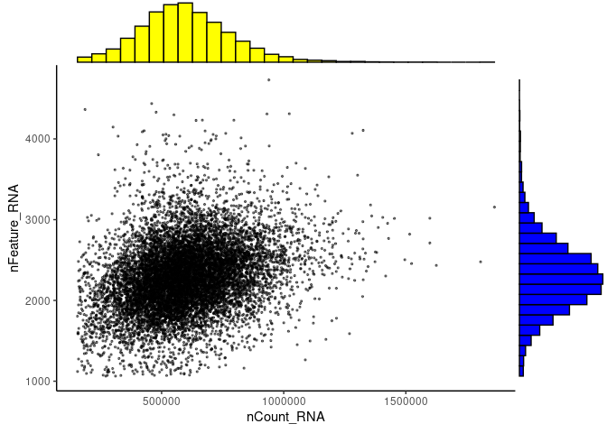
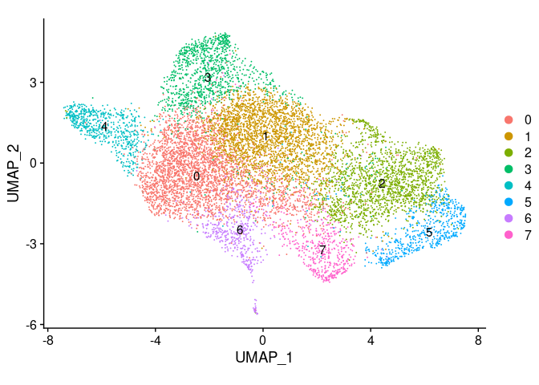
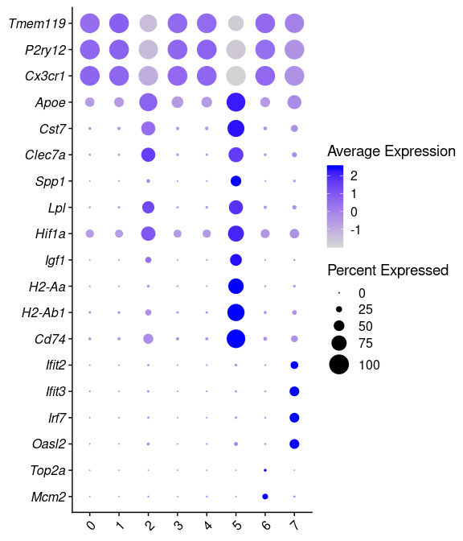

### Load libraries and define file path

```r
library(tidyverse)
library(Seurat)
library(cowplot)
source("../05_function/norm_scale_dim_cluster_qc.R")

input_path <- "../02_data/mic_comp_Strooper/"
output_path <- "../03_results/06a_mic_Strooper/"
```

### Download raw counts and metadata
Data related for comparison: https://www.ncbi.nlm.nih.gov/geo/query/acc.cgi?acc=GSE127892
RNA-Seq of cortical and hippocampal microglia in female and male C57Bl/6 wild type mice and in AppNL-G-F mice M3, M6, M12, M21 (32 experimental conditions, 2 mice per condition - data pooled). 


```r
destfile_meta <- paste(input_path, "GSE127892_microglia.kw.meta.csv.gz", sep="")
destfile_raw <- paste(input_path, "GSE127892_microglia.kw.raw.tsv.gz", sep="") 
```


### Build Seurat object

```r
meta <- read_csv(destfile_meta %>% str_remove(".gz"))
counts <- read_tsv(destfile_raw %>% str_remove(".gz")) # checking if the gene name duplicate before converting into rownames
counts <- counts %>% column_to_rownames(var="X1")

meta <- meta %>% filter(sampleName %in% colnames(counts))

counts <- counts[, meta$sampleName]

all(meta$sampleName==colnames(counts))

meta <- column_to_rownames(meta, var = "sampleName")
```


```r
mic <- CreateSeuratObject(counts = counts, meta.data = meta)  
mic[["percent.mt"]] <- PercentageFeatureSet(mic, pattern = "^mt-")
ribo.genes <- grep(pattern = "^Rp[sl][[:digit:]]", x = rownames(mic@assays$RNA), value = TRUE)
mic$percent.ribo <- PercentageFeatureSet(mic, features = ribo.genes)
mic <- AddModuleScore(object = mic, features = list(ribo.genes), ctrl = 100, name = 'ribo_Features') 

VlnPlot(mic, features = c("nFeature_RNA", "nCount_RNA", "percent.mt", "percent.ribo", "ribo_Features1"), ncol = 5, pt.size = 0.01) +
  theme(axis.text.x = element_blank())

p <- ggplot(mic@meta.data, aes(x= nCount_RNA, y=nFeature_RNA)) + geom_point(alpha=0.5, size=0.5) + theme_classic()
ggExtra::ggMarginal(p, type = "histogram", xparams = list(fill = "yellow"), yparams = list(fill="blue"))
```


```r
glimpse(mic@meta.data)

mic <- mic %>% 
  NormalizeData() %>% 
  FindVariableFeatures(selection.method = "vst", nfeatures =  4777) %>% 
  ScaleData(vars.to.regress = c("nCount_RNA", "percent.mt")) %>% 
  RunPCA()

mic <- JackStraw(mic, num.replicate = 30, dim=30)
mic<- ScoreJackStraw(mic, dims = 1:30)
ElbowPlot(mic, ndims = 30)

print(mic[["pca"]], dims = 1:30, nfeatures = 30)
```


```r
# choose dimensions of PCA after checking ElbowPlot and positive genes in each clusters. 
pca_dim <- 14 # the author used 14 PCA dimension

mic <- mic %>% 
  RunUMAP(reduction = "pca", dims = 1:pca_dim) %>% 
  FindNeighbors(reduction = "pca", dims = 1:pca_dim) %>% 
  FindClusters(resolution = 0.5)
```

Save the Seurat object

```r
saveRDS(mic, file = "../output-paper/04_Strooper_compare/Seurat_Strooper.RDS")
```


### Reload saved seurat object

```r
mic <- readRDS(paste(output_path, "Seurat_Strooper.RDS", sep = ""))

p <- ggplot(mic@meta.data, aes(x= nCount_RNA, y=nFeature_RNA)) + geom_point(alpha=0.5, size=0.5) + theme_classic()
ggExtra::ggMarginal(p, type = "histogram", xparams = list(fill = "yellow"), yparams = list(fill="blue"))
```

<!-- -->

This QC plot is the microglia cells that has already passed QC. The same QC plot Figure S2A in the paper.


### UMAP plot


```r
DimPlot(mic, reduction = "umap", label = TRUE, pt.size = 0.001) + 
   coord_fixed()
```

<!-- -->


```r
# QC: violin plot of nfeatures_RNA, percent.mt, percent.ribo for each cluster
# function: QC_plot(data, y) from source
p_QC <- c("nFeature_RNA", "percent.mt", "percent.ribo") %>% map(~QC_plot(mic@meta.data, .))
p <- plot_grid(plotlist=p_QC, ncol=1, align="hv")
#title <- ggdraw() + draw_label(paste(strain, round, res, "QC", sep=" "), fontface='bold')
plot_grid(title, p, ncol=1, rel_heights=c(0.1, 1))
```


### Find marker genes for microglia clusters


```r
mic.markers <- FindAllMarkers(mic, only.pos = FALSE, min.pct = 0.25, logfc.threshold = 0.25, max.cells.per.ident=300)
mic.markers <- mic.markers %>% rownames_to_column(var="symbol")
mic.markers %>% group_by(cluster) %>% top_n(n=-10, wt=p_val_adj) # do NOT put quotation mark on the wt argument # show top markers
```

```
## # A tibble: 109 x 8
## # Groups:   cluster [8]
##    symbol      p_val avg_logFC pct.1 pct.2 p_val_adj cluster gene    
##    <chr>       <dbl>     <dbl> <dbl> <dbl>     <dbl> <fct>   <chr>   
##  1 Ctsb     3.23e-18    -0.641 0.994 0.998  9.52e-14 0       Ctsb    
##  2 B2m      1.62e-16    -0.426 0.999 1      4.78e-12 0       B2m     
##  3 Fth1     4.30e-14    -0.525 0.98  0.995  1.27e- 9 0       Fth1    
##  4 Xist     1.99e-13     0.708 0.578 0.361  5.87e- 9 0       Xist    
##  5 Ctsd     3.57e-13    -0.426 1     1      1.05e- 8 0       Ctsd    
##  6 Lyz2     7.47e-13    -1.21  0.516 0.728  2.20e- 8 0       Lyz2    
##  7 H2-D1    5.65e-12    -0.712 0.702 0.842  1.66e- 7 0       H2-D1   
##  8 Ctsz     1.35e-11    -0.455 0.977 0.991  3.99e- 7 0       Ctsz    
##  9 Cd9      8.80e-11    -0.467 0.964 0.981  2.59e- 6 0       Cd9     
## 10 Ivns1abp 9.17e-11     0.303 0.991 0.956  2.70e- 6 0       Ivns1abp
## # … with 99 more rows
```

```r
write_delim(mic.markers, paste(output_path, "Seurat_Strooper_markers.txt", sep = ""), delim = "\t")
```

### Dotplot of marker genes


```r
#genes <- c("Itgam", "Tmem119", "S100a4", "Mrc1", "Cd163", "Cd74", "Cd79b", "Rag1", "Trbc2", "Cd3g", "Nkg7", "Ccr2", "Gria2", "Rbfox3", "Gfap", "Aldh1a1", "Aqp4", "Olig1")

genes <- c("Tmem119", "P2ry12", "Cx3cr1", "Apoe", "Cst7", "Clec7a", "Spp1", "Lpl", "Hif1a", "Igf1", "H2-Aa", "H2-Ab1", "Cd74", "Ifit2", "Ifit3", "Irf7", "Oasl2", "Top2a", "Mcm2")

DotPlot(mic, features = genes, dot.scale = 8) + 
  RotatedAxis() + coord_flip() + 
  theme(axis.title = element_blank(), axis.text.y = element_text(face = "italic"))
```

<!-- -->

### Clusters recovered in Bart de Strooper's dataset
HM: cluster 0,1,3,5
DAM1: cluster 2
DAM2: cluster 5
CPM: cluster 6
IRM: cluster 7
