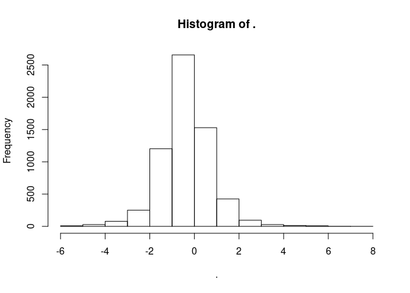
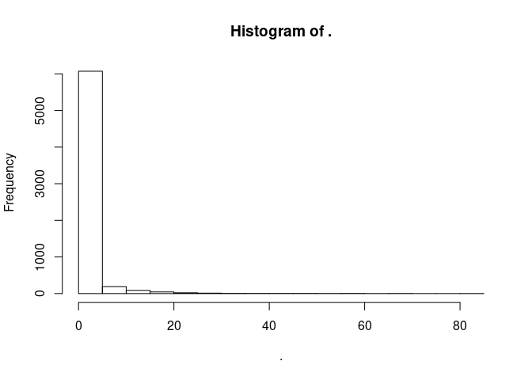
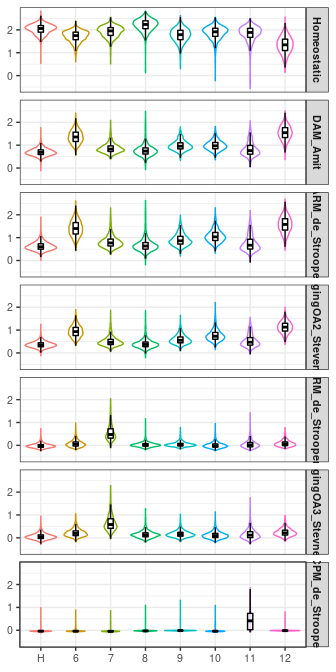

```r
knitr::opts_chunk$set(warning=FALSE, message=FALSE)
```

## Compare microglia from other datasets with ours using AddModuleScore function in Seurat
#### Beth Steven's aging dataset
#### Bart de Strooper's AD dataset
#### Ido Amit's AD dataset


```r
library(Seurat)
library(patchwork)
library(tidyverse)
```


### Load our dataset


```r
output_path <- "../03_results/07a_mic_compare_ms_annotation/"

cd11b.integrated <- readRDS("../02_data/intermediate_rds/mg_int.rds") 

## combine homeostatic microglia
cd11b.integrated$final_clusters <-  ifelse(cd11b.integrated$seurat_clusters %in% 0:5,"H",
                                           cd11b.integrated$seurat_clusters %>% as.character())
cd11b.integrated$final_clusters <- factor(cd11b.integrated$final_clusters, 
                                          levels = c("H", "6", "7", "8", "9", "10", "11", "12"))
cd11b.integrated$Genotype <- factor(cd11b.integrated$Genotype, levels = c("WT", "APP/PS1"))

cd11b.integrated$Strain <- gsub("B6J", "B6", cd11b.integrated$Strain)
cd11b.integrated$Strain <- factor(cd11b.integrated$Strain, levels = c("B6", "CAST", "PWK", "WSB"))

cd11b.integrated$Group <- gsub("B6J", "B6", cd11b.integrated$Group)

cd11b.integrated$Group <- factor(cd11b.integrated$Group, 
                                 levels=c("B6_WT", "B6_APP/PS1", "CAST_WT", "CAST_APP/PS1", "PWK_WT","PWK_APP/PS1", "WSB_WT", "WSB_APP/PS1"))
```


### Load marker genes of DAM in Ido Amits dataset
select top DAM marker genes


```r
df_comp <- readxl::read_xlsx("../02_data/mic_comp_Amit/Amit_HvsDAM.xlsx", col_types=c("text", rep("numeric",4)))

## The spread sheet is from Table S3 of Ido Amit's DAM paper: https://www.cell.com/fulltext/S0092-8674(17)30578-0
## Original link of the dataset is:
# "https://www.cell.com/cms/10.1016/j.cell.2017.05.018/attachment/84d2cdbe-568b-456d-8ab5-a5580ac075b6/mmc4.xlsx"

names(df_comp) <- c("Symbol", "UMI_H", "log2FC", "log10p", "log10FDR")

df_comp <- mutate(df_comp, 
                      p_val=10^(-log10p), 
                      p_val_adj=10^(-log10FDR))

df_comp$log2FC %>% hist() 
```

<!-- -->

```r
df_comp$log2FC %>% summary()
```

```
##    Min. 1st Qu.  Median    Mean 3rd Qu.    Max.    NA's 
## -5.8685 -0.9925 -0.3763 -0.3663  0.2254  7.8604     168
```

```r
df_comp$log10FDR %>% hist()
```

<!-- -->

```r
df_comp$log10FDR %>% summary()
```

```
##    Min. 1st Qu.  Median    Mean 3rd Qu.    Max.    NA's 
##  0.2087  0.2928  0.4627  1.5366  0.9656 84.9141      31
```

```r
## DAM markers
top <- 50
df_DAM <- df_comp %>% filter(log10FDR>10, log2FC>0.5, str_detect(Symbol, "^Gm", negate = TRUE)) %>% arrange(desc(log10FDR)) %>% head(50) ## top 49 genes

df_DAM
```

```
## # A tibble: 50 x 7
##    Symbol   UMI_H log2FC log10p log10FDR    p_val p_val_adj
##    <chr>    <dbl>  <dbl>  <dbl>    <dbl>    <dbl>     <dbl>
##  1 Cst7    0.0841   6.08   88.5     84.9 3.05e-89  1.22e-85
##  2 Lyz2    0.421    3.46   70.4     67.1 4.15e-71  8.29e-68
##  3 Lpl     0.0974   4.95   69.2     66.1 6.55e-70  8.72e-67
##  4 Ctsb    3.78     2.04   68.3     65.3 5.55e-69  5.54e-66
##  5 Ctsd   13.8      1.45   65.9     63.0 1.23e-66  9.83e-64
##  6 Apoe    2.92     3.43   62.7     59.9 1.82e-63  1.21e-60
##  7 B2m     7.07     1.37   59.9     57.2 1.40e-60  6.97e-58
##  8 Gnas    1.48     2.15   53.8     51.2 1.76e-54  6.39e-52
##  9 Cd9     1.40     2.07   53.4     50.8 4.40e-54  1.46e-51
## 10 Ank     0.055    4.88   52.0     49.5 1.09e-52  3.35e-50
## # … with 40 more rows
```

```r
gene_DAM <- df_DAM$Symbol %>% unlist()

gene_Homeo <- c("Tmem119", "Cx3cr1", "P2ry12", "P2ry13", "Cx3cr1", "Olfml3",  "Selplg", "Siglech", "Csf1r", "Cst3", "Sparc", "C1qa", "C1qb", "C1qc", "Tmsb4x", "Sall1", "Fcrls", "Gpr34", "Spi1",  "Mafb", "Maf", "Mef2a", "Irf8") 
```


```r
cd11b.integrated <- AddModuleScore(object = cd11b.integrated, features = list(gene_DAM), ctrl = 100, name = 'DAM_feature') 

cd11b.integrated <- AddModuleScore(object = cd11b.integrated, features = list(gene_Homeo), ctrl = 100, name = 'Homeostatic_feature') 
```


### Load marker genes of ARM, IRM, CPM in Strooper's dataset
#### The marker genes is not readily uploaded onto the website, we recovered their dataset and calculated marker genes


```r
df_comp <- read_delim("../03_results/06a_mic_Strooper/Seurat_Strooper_markers.txt", delim = "\t")

df_comp %>% group_by(cluster) %>% top_n(n=-10, wt=p_val_adj)
```

```
## # A tibble: 109 x 8
## # Groups:   cluster [8]
##    symbol      p_val avg_logFC pct.1 pct.2 p_val_adj cluster gene    
##    <chr>       <dbl>     <dbl> <dbl> <dbl>     <dbl>   <dbl> <chr>   
##  1 Ctsb     3.23e-18    -0.641 0.994 0.998  9.52e-14       0 Ctsb    
##  2 B2m      1.62e-16    -0.426 0.999 1      4.78e-12       0 B2m     
##  3 Fth1     4.30e-14    -0.525 0.98  0.995  1.27e- 9       0 Fth1    
##  4 Xist     1.99e-13     0.708 0.578 0.361  5.87e- 9       0 Xist    
##  5 Ctsd     3.57e-13    -0.426 1     1      1.05e- 8       0 Ctsd    
##  6 Lyz2     7.47e-13    -1.21  0.516 0.728  2.20e- 8       0 Lyz2    
##  7 H2-D1    5.65e-12    -0.712 0.702 0.842  1.66e- 7       0 H2-D1   
##  8 Ctsz     1.35e-11    -0.455 0.977 0.991  3.99e- 7       0 Ctsz    
##  9 Cd9      8.80e-11    -0.467 0.964 0.981  2.59e- 6       0 Cd9     
## 10 Ivns1abp 9.17e-11     0.303 0.991 0.956  2.70e- 6       0 Ivns1abp
## # … with 99 more rows
```

### ARM, IRM, CPM

```r
gene_ARM <- df_comp %>% filter(cluster==2, -log10(p_val_adj)>10, avg_logFC>0.5, str_detect(gene, "^Gm", negate = TRUE)) %>% arrange(desc(-log10(p_val_adj))) %>% .$gene %>% unlist() %>% head(top) 
gene_IRM <- df_comp %>% filter(cluster==7, -log10(p_val_adj)>10, avg_logFC>0.5, str_detect(gene, "^Gm", negate = TRUE)) %>% .$gene %>% unlist() %>% head(top)
gene_CPM <- df_comp %>% filter(cluster==6, -log10(p_val_adj)>10, avg_logFC>0.5) %>% .$gene %>% unlist() %>% head(top)
gene_CPM <- c(gene_CPM, "Top2a", "Mcm2") # 4 genes adding original data.
```


```r
feature="ARM_feature"
cd11b.integrated <- AddModuleScore(object = cd11b.integrated, features = list(gene_ARM), ctrl = 100, name = feature) 

feature="IRM_feature"
cd11b.integrated <- AddModuleScore(object = cd11b.integrated, features = list(gene_IRM), ctrl = 100, name = feature) 

feature="CPM_feature"
cd11b.integrated <- AddModuleScore(object = cd11b.integrated, features = list(gene_CPM), ctrl = 100, name = feature) 
```


### Load marker genes of OA2 (Ccl3/Ccl4 enriched), OA3 (IRM equivalent) in Steven's dataset

```r
input_file <- "../02_data/mic_comp_Stevens/Stevens_cluster_marker.xlsx"
M_stevens_sheet_name <- readxl::excel_sheets(input_file)

sheet <- 1:(length(M_stevens_sheet_name)-1) # do not include the last Transcription factors

df_comp <- vector(mode = "list", length = length(sheet))

for(i in sheet){
  df_comp[[i]] <- readxl::read_xlsx(input_file, sheet = i, skip = 2)
  df_comp[[i]] <- df_comp[[i]] %>% 
    select(1:6)%>% 
    mutate(cluster=M_stevens_sheet_name[i]) 
}

df_comp <- do.call(rbind, df_comp)

colnames(df_comp) <- c("gene", "FC", "p_val", "p_val_adj", "pct_1", "pct_2", "cluster")

df_comp <- df_comp %>% mutate(cluster=str_remove_all(cluster, "Cluster|\\(|\\)| "), 
                              p_val=as.double(p_val),
                              p_val_adj=as.double(p_val_adj))
df_comp$cluster %>% unique()
```

```
##  [1] "1"               "2a"              "2b"             
##  [4] "2c"              "3"               "4"              
##  [7] "5"               "6"               "7a"             
## [10] "7b"              "7c"              "8"              
## [13] "9"               "Mono_MacA"       "Mono_MacB"      
## [16] "AgingOA1a"       "AgingOA1b"       "AgingOA2"       
## [19] "AgingOA3"        "AgingOAMono_Mac" "Injury1IR1"     
## [22] "Injury2IR2"
```


```r
gene_OA2 <- df_comp %>% filter(cluster=="AgingOA2", -log10(p_val_adj)>10, log2(FC)>0.5, str_detect(gene, "^Gm", negate = TRUE)) %>% arrange(p_val_adj, desc(FC)) %>% head(50) %>% .$gene %>% unlist() # 50 genes

gene_OA3 <- df_comp %>% filter(cluster=="AgingOA3", -log10(p_val_adj)>10, log2(FC)>0.5, str_detect(gene, "^Gm", negate = TRUE)) %>% arrange(p_val_adj, desc(FC)) %>% head(50) %>% .$gene %>% unlist() # 19 genes


feature="Aging_OA2"
cd11b.integrated <- AddModuleScore(object = cd11b.integrated, features = list(gene_OA2), ctrl = 100, name = feature) 

feature="Aging_OA3"
cd11b.integrated <- AddModuleScore(object = cd11b.integrated, features = list(gene_OA3), ctrl = 100, name = feature) 
```

### Plot Violin plot for mouse microglia feature from multiple studies

```r
meta <- cd11b.integrated@meta.data

meta_tidy <- meta %>% 
  select(Strain, Genotype, final_clusters:Aging_OA31) %>% 
  gather(key="study", value = "z_score", -Strain, -Genotype, -final_clusters)

study_ms <- c("Homeostatic_feature1", "DAM_feature1", "ARM_feature1", "Aging_OA21", "IRM_feature1", "Aging_OA31", "CPM_feature1")
study_ms_lab <- c("Homeostatic", "DAM_Amit", "ARM_de_Strooper", "AgingOA2_Stevens", "IRM_de_Strooper", "AgingOA3_Stevnes", "CPM_de_Strooper")

meta_tidy <- meta_tidy %>% 
  filter(study %in% study_ms) %>% 
  mutate(study = factor(study, levels = study_ms, labels = study_ms_lab))

meta_tidy%>% 
  ggplot(aes(y=z_score, x= final_clusters, color= final_clusters)) +
    facet_grid(study ~ ., scales= "fixed") +
    geom_violin() +
    geom_boxplot(width=0.15, outlier.shape = NA, color = "black", alpha=0.7) +
    theme_bw()+
    theme(legend.position = "none", 
          axis.title = element_blank(), 
          strip.text = element_text(face = "bold", size = 8, family = "Arial"),
          axis.text = element_text(size = 8))
```

<!-- -->

```r
ggsave(paste(output_path, "Vln_ms_multi_comp.png", sep = ""), dpi = 300, width = 3.5, height = 5)
```


## Comparing the z-score across clusters for each feature (two-way ANOVA)

### DAM_feature1 (Amit)

```r
clusters <- levels(meta$final_clusters) %>% as.list()

####single function for stain and GT interaction
data = meta %>% filter(final_clusters %in% clusters[[2]])
aov_object = aov(DAM_feature1 ~ Strain*Genotype , data=data)
aov.pvals = summary(aov_object)
aov.pvals= aov.pvals[[1]][5] %>% t() %>% as.data.frame()
names(aov.pvals) <- c("Strain", "Genotype", "Strain_Genotype", "Residuals")
aov.pvals <- aov.pvals %>% 
  select(-Residuals) %>% 
  mutate(Cluster = clusters[2] %>% as.character())

### wrap into function for DAM_feature1
aov_StrainGT <- function(cluster, data){
  data = data %>% filter(final_clusters %in% clusters)
  aov_object = aov(DAM_feature1 ~ Strain*Genotype, data=data)
  aov.pvals = summary(aov_object)
  aov.pvals= aov.pvals[[1]][5] %>% t() %>% as.data.frame()
  names(aov.pvals) <- c("Strain", "Genotype", "Strain_Genotype", "Residuals")
  aov.pvals <- aov.pvals %>% 
    select(-Residuals) %>% 
    mutate(Cluster = cluster %>% as.character())
  return(aov.pvals)
}

aov_StrainGT_object <- function(cluster, data){
  data = data %>% filter(final_clusters %in% clusters)
  aov_object = aov(DAM_feature1 ~ Strain*Genotype, data=data)
  return(aov_object)
}

aov_StrainGT_table <- clusters %>% map_df(aov_StrainGT, data=meta)
aov_StrainGT_table <- aov_StrainGT_table %>% mutate_if(is.double, p.adjust)

aov_StrainGT_table$Cluster[aov_StrainGT_table$Strain_Genotype<0.05]
```

```
## [1] "H"  "6"  "7"  "8"  "9"  "10" "11" "12"
```

```r
aov_StrainGT_table$Cluster[aov_StrainGT_table$Strain<0.05]
```

```
## [1] "H"  "6"  "7"  "8"  "9"  "10" "11" "12"
```

```r
aov_StrainGT_table$Cluster[aov_StrainGT_table$Genotype<0.05]
```

```
## [1] "H"  "6"  "7"  "8"  "9"  "10" "11" "12"
```

All clusters have strain, genotype and strain by genotype effects for DAM_feature1, we focus on cluster 6 and cluster 12. 


```r
aov_object_list <- clusters %>% map(aov_StrainGT_object, data=meta)
names(aov_object_list) <- clusters %>% unlist()

TukeyHSD(aov_object_list[["6"]]) %>% .$`Strain:Genotype` %>% data.frame(.,cluster="6")
```

```
##                                  diff          lwr         upr
## CAST:WT-B6:WT            -0.194507149 -0.204160205 -0.18485409
## PWK:WT-B6:WT             -0.175956708 -0.186081990 -0.16583143
## WSB:WT-B6:WT             -0.128657215 -0.139523248 -0.11779118
## B6:APP/PS1-B6:WT          0.196789552  0.186613413  0.20696569
## CAST:APP/PS1-B6:WT        0.092059926  0.081336193  0.10278366
## PWK:APP/PS1-B6:WT         0.005967841 -0.005195763  0.01713145
## WSB:APP/PS1-B6:WT        -0.070605659 -0.080318205 -0.06089311
## PWK:WT-CAST:WT            0.018550441  0.009577650  0.02752323
## WSB:WT-CAST:WT            0.065849933  0.056048898  0.07565097
## B6:APP/PS1-CAST:WT        0.391296701  0.382266561  0.40032684
## CAST:APP/PS1-CAST:WT      0.286567075  0.276924042  0.29621011
## PWK:APP/PS1-CAST:WT       0.200474990  0.190345049  0.21060493
## WSB:APP/PS1-CAST:WT       0.123901489  0.115397186  0.13240579
## WSB:WT-PWK:WT             0.047299493  0.037033035  0.05756595
## B6:APP/PS1-PWK:WT         0.372746260  0.363212987  0.38227953
## CAST:APP/PS1-PWK:WT       0.268016634  0.257900907  0.27813236
## PWK:APP/PS1-PWK:WT        0.181924549  0.171343644  0.19250545
## WSB:APP/PS1-PWK:WT        0.105351049  0.096314288  0.11438781
## B6:APP/PS1-WSB:WT         0.325446767  0.315130149  0.33576339
## CAST:APP/PS1-WSB:WT       0.220717142  0.209860011  0.23157427
## PWK:APP/PS1-WSB:WT        0.134625056  0.123333251  0.14591686
## WSB:APP/PS1-WSB:WT        0.058051556  0.048191923  0.06791119
## CAST:APP/PS1-B6:APP/PS1  -0.104729626 -0.114896257 -0.09456299
## PWK:APP/PS1-B6:APP/PS1   -0.190821711 -0.201451292 -0.18019213
## WSB:APP/PS1-B6:APP/PS1   -0.267395211 -0.276488917 -0.25830151
## PWK:APP/PS1-CAST:APP/PS1 -0.086092086 -0.097247024 -0.07493715
## WSB:APP/PS1-CAST:APP/PS1 -0.162665586 -0.172368170 -0.15296300
## WSB:APP/PS1-PWK:APP/PS1  -0.076573500 -0.086760146 -0.06638685
##                                 p.adj cluster
## CAST:WT-B6:WT            0.000000e+00       6
## PWK:WT-B6:WT             0.000000e+00       6
## WSB:WT-B6:WT             0.000000e+00       6
## B6:APP/PS1-B6:WT         0.000000e+00       6
## CAST:APP/PS1-B6:WT       0.000000e+00       6
## PWK:APP/PS1-B6:WT        7.381829e-01       6
## WSB:APP/PS1-B6:WT        0.000000e+00       6
## PWK:WT-CAST:WT           1.035419e-08       6
## WSB:WT-CAST:WT           0.000000e+00       6
## B6:APP/PS1-CAST:WT       0.000000e+00       6
## CAST:APP/PS1-CAST:WT     0.000000e+00       6
## PWK:APP/PS1-CAST:WT      0.000000e+00       6
## WSB:APP/PS1-CAST:WT      0.000000e+00       6
## WSB:WT-PWK:WT            0.000000e+00       6
## B6:APP/PS1-PWK:WT        0.000000e+00       6
## CAST:APP/PS1-PWK:WT      0.000000e+00       6
## PWK:APP/PS1-PWK:WT       0.000000e+00       6
## WSB:APP/PS1-PWK:WT       0.000000e+00       6
## B6:APP/PS1-WSB:WT        0.000000e+00       6
## CAST:APP/PS1-WSB:WT      0.000000e+00       6
## PWK:APP/PS1-WSB:WT       0.000000e+00       6
## WSB:APP/PS1-WSB:WT       0.000000e+00       6
## CAST:APP/PS1-B6:APP/PS1  0.000000e+00       6
## PWK:APP/PS1-B6:APP/PS1   0.000000e+00       6
## WSB:APP/PS1-B6:APP/PS1   0.000000e+00       6
## PWK:APP/PS1-CAST:APP/PS1 0.000000e+00       6
## WSB:APP/PS1-CAST:APP/PS1 0.000000e+00       6
## WSB:APP/PS1-PWK:APP/PS1  0.000000e+00       6
```

```r
TukeyHSD(aov_object_list[["12"]]) %>% .$`Strain:Genotype` %>% data.frame(.,cluster="12")
```

```
##                                  diff          lwr         upr
## CAST:WT-B6:WT            -0.194507149 -0.204160205 -0.18485409
## PWK:WT-B6:WT             -0.175956708 -0.186081990 -0.16583143
## WSB:WT-B6:WT             -0.128657215 -0.139523248 -0.11779118
## B6:APP/PS1-B6:WT          0.196789552  0.186613413  0.20696569
## CAST:APP/PS1-B6:WT        0.092059926  0.081336193  0.10278366
## PWK:APP/PS1-B6:WT         0.005967841 -0.005195763  0.01713145
## WSB:APP/PS1-B6:WT        -0.070605659 -0.080318205 -0.06089311
## PWK:WT-CAST:WT            0.018550441  0.009577650  0.02752323
## WSB:WT-CAST:WT            0.065849933  0.056048898  0.07565097
## B6:APP/PS1-CAST:WT        0.391296701  0.382266561  0.40032684
## CAST:APP/PS1-CAST:WT      0.286567075  0.276924042  0.29621011
## PWK:APP/PS1-CAST:WT       0.200474990  0.190345049  0.21060493
## WSB:APP/PS1-CAST:WT       0.123901489  0.115397186  0.13240579
## WSB:WT-PWK:WT             0.047299493  0.037033035  0.05756595
## B6:APP/PS1-PWK:WT         0.372746260  0.363212987  0.38227953
## CAST:APP/PS1-PWK:WT       0.268016634  0.257900907  0.27813236
## PWK:APP/PS1-PWK:WT        0.181924549  0.171343644  0.19250545
## WSB:APP/PS1-PWK:WT        0.105351049  0.096314288  0.11438781
## B6:APP/PS1-WSB:WT         0.325446767  0.315130149  0.33576339
## CAST:APP/PS1-WSB:WT       0.220717142  0.209860011  0.23157427
## PWK:APP/PS1-WSB:WT        0.134625056  0.123333251  0.14591686
## WSB:APP/PS1-WSB:WT        0.058051556  0.048191923  0.06791119
## CAST:APP/PS1-B6:APP/PS1  -0.104729626 -0.114896257 -0.09456299
## PWK:APP/PS1-B6:APP/PS1   -0.190821711 -0.201451292 -0.18019213
## WSB:APP/PS1-B6:APP/PS1   -0.267395211 -0.276488917 -0.25830151
## PWK:APP/PS1-CAST:APP/PS1 -0.086092086 -0.097247024 -0.07493715
## WSB:APP/PS1-CAST:APP/PS1 -0.162665586 -0.172368170 -0.15296300
## WSB:APP/PS1-PWK:APP/PS1  -0.076573500 -0.086760146 -0.06638685
##                                 p.adj cluster
## CAST:WT-B6:WT            0.000000e+00      12
## PWK:WT-B6:WT             0.000000e+00      12
## WSB:WT-B6:WT             0.000000e+00      12
## B6:APP/PS1-B6:WT         0.000000e+00      12
## CAST:APP/PS1-B6:WT       0.000000e+00      12
## PWK:APP/PS1-B6:WT        7.381829e-01      12
## WSB:APP/PS1-B6:WT        0.000000e+00      12
## PWK:WT-CAST:WT           1.035419e-08      12
## WSB:WT-CAST:WT           0.000000e+00      12
## B6:APP/PS1-CAST:WT       0.000000e+00      12
## CAST:APP/PS1-CAST:WT     0.000000e+00      12
## PWK:APP/PS1-CAST:WT      0.000000e+00      12
## WSB:APP/PS1-CAST:WT      0.000000e+00      12
## WSB:WT-PWK:WT            0.000000e+00      12
## B6:APP/PS1-PWK:WT        0.000000e+00      12
## CAST:APP/PS1-PWK:WT      0.000000e+00      12
## PWK:APP/PS1-PWK:WT       0.000000e+00      12
## WSB:APP/PS1-PWK:WT       0.000000e+00      12
## B6:APP/PS1-WSB:WT        0.000000e+00      12
## CAST:APP/PS1-WSB:WT      0.000000e+00      12
## PWK:APP/PS1-WSB:WT       0.000000e+00      12
## WSB:APP/PS1-WSB:WT       0.000000e+00      12
## CAST:APP/PS1-B6:APP/PS1  0.000000e+00      12
## PWK:APP/PS1-B6:APP/PS1   0.000000e+00      12
## WSB:APP/PS1-B6:APP/PS1   0.000000e+00      12
## PWK:APP/PS1-CAST:APP/PS1 0.000000e+00      12
## WSB:APP/PS1-CAST:APP/PS1 0.000000e+00      12
## WSB:APP/PS1-PWK:APP/PS1  0.000000e+00      12
```


### IRM_feature1 (Bart de Strooper)


```r
clusters <- levels(meta$final_clusters) %>% as.list()
sig.level <- 1e-10

### function for IRM_feature1
aov_StrainGT <- function(cluster, data){
  data = data %>% filter(final_clusters %in% clusters)
  aov_object = aov(IRM_feature1 ~ Strain*Genotype, data=data) ## IRM
  aov.pvals = summary(aov_object)
  aov.pvals= aov.pvals[[1]][5] %>% t() %>% as.data.frame()
  names(aov.pvals) <- c("Strain", "Genotype", "Strain_Genotype", "Residuals")
  aov.pvals <- aov.pvals %>% 
    select(-Residuals) %>% 
    mutate(Cluster = cluster %>% as.character())
  return(aov.pvals)
}

aov_StrainGT_object <- function(cluster, data){
  data = data %>% filter(final_clusters %in% clusters)
  aov_object = aov(IRM_feature1 ~ Strain*Genotype, data=data)  ## IRM
  return(aov_object)
}

aov_StrainGT_table <- clusters %>% map_df(aov_StrainGT, data=meta)
aov_StrainGT_table <- aov_StrainGT_table %>% mutate_if(is.double, p.adjust)

aov_StrainGT_table$Cluster[aov_StrainGT_table$Strain_Genotype<sig.level]
```

```
## [1] "H"  "6"  "7"  "8"  "9"  "10" "11" "12"
```

```r
aov_StrainGT_table$Cluster[aov_StrainGT_table$Strain<sig.level]
```

```
## [1] "H"  "6"  "7"  "8"  "9"  "10" "11" "12"
```

```r
aov_StrainGT_table$Cluster[aov_StrainGT_table$Genotype<sig.level]
```

```
## [1] "H"  "6"  "7"  "8"  "9"  "10" "11" "12"
```


```r
aov_object_list <- clusters %>% map(aov_StrainGT_object, data=meta)
names(aov_object_list) <- clusters %>% unlist()

TukeyHSD(aov_object_list[["7"]]) %>% .$`Strain:Genotype` %>% data.frame(.,cluster="7")
```

```
##                                 diff         lwr          upr        p.adj
## CAST:WT-B6:WT            -0.14600381 -0.15204634 -0.139961279 0.000000e+00
## PWK:WT-B6:WT             -0.06488020 -0.07121833 -0.058542068 0.000000e+00
## WSB:WT-B6:WT             -0.04591947 -0.05272129 -0.039117652 0.000000e+00
## B6:APP/PS1-B6:WT          0.04616165  0.03979168  0.052531613 0.000000e+00
## CAST:APP/PS1-B6:WT       -0.09774290 -0.10445564 -0.091030152 0.000000e+00
## PWK:APP/PS1-B6:WT         0.03575427  0.02876618  0.042742363 0.000000e+00
## WSB:APP/PS1-B6:WT        -0.01872649 -0.02480626 -0.012646715 7.982504e-14
## PWK:WT-CAST:WT            0.08112361  0.07550691  0.086740316 0.000000e+00
## WSB:WT-CAST:WT            0.10008434  0.09394918  0.106219501 0.000000e+00
## B6:APP/PS1-CAST:WT        0.19216546  0.18651285  0.197818062 0.000000e+00
## CAST:APP/PS1-CAST:WT      0.04826091  0.04222466  0.054297172 0.000000e+00
## PWK:APP/PS1-CAST:WT       0.18175808  0.17541704  0.188099130 0.000000e+00
## WSB:APP/PS1-CAST:WT       0.12727733  0.12195388  0.132600771 0.000000e+00
## WSB:WT-PWK:WT             0.01896073  0.01253422  0.025387230 5.573320e-14
## B6:APP/PS1-PWK:WT         0.11104185  0.10507430  0.117009397 0.000000e+00
## CAST:APP/PS1-PWK:WT      -0.03286270 -0.03919485 -0.026530547 0.000000e+00
## PWK:APP/PS1-PWK:WT        0.10063447  0.09401113  0.107257809 0.000000e+00
## WSB:APP/PS1-PWK:WT        0.04615371  0.04049697  0.051810462 0.000000e+00
## B6:APP/PS1-WSB:WT         0.09208112  0.08562322  0.098539021 0.000000e+00
## CAST:APP/PS1-WSB:WT      -0.05182342 -0.05861967 -0.045027178 0.000000e+00
## PWK:APP/PS1-WSB:WT        0.08167374  0.07460540  0.088742085 0.000000e+00
## WSB:APP/PS1-WSB:WT        0.02719299  0.02102114  0.033364829 0.000000e+00
## CAST:APP/PS1-B6:APP/PS1  -0.14390454 -0.15026856 -0.137540529 0.000000e+00
## PWK:APP/PS1-B6:APP/PS1   -0.01040737 -0.01706118 -0.003753567 5.811675e-05
## WSB:APP/PS1-B6:APP/PS1   -0.06488813 -0.07058053 -0.059195738 0.000000e+00
## PWK:APP/PS1-CAST:APP/PS1  0.13349717  0.12651450  0.140479834 0.000000e+00
## WSB:APP/PS1-CAST:APP/PS1  0.07901641  0.07294288  0.085089946 0.000000e+00
## WSB:APP/PS1-PWK:APP/PS1  -0.05448076 -0.06085730 -0.048104215 0.000000e+00
##                          cluster
## CAST:WT-B6:WT                  7
## PWK:WT-B6:WT                   7
## WSB:WT-B6:WT                   7
## B6:APP/PS1-B6:WT               7
## CAST:APP/PS1-B6:WT             7
## PWK:APP/PS1-B6:WT              7
## WSB:APP/PS1-B6:WT              7
## PWK:WT-CAST:WT                 7
## WSB:WT-CAST:WT                 7
## B6:APP/PS1-CAST:WT             7
## CAST:APP/PS1-CAST:WT           7
## PWK:APP/PS1-CAST:WT            7
## WSB:APP/PS1-CAST:WT            7
## WSB:WT-PWK:WT                  7
## B6:APP/PS1-PWK:WT              7
## CAST:APP/PS1-PWK:WT            7
## PWK:APP/PS1-PWK:WT             7
## WSB:APP/PS1-PWK:WT             7
## B6:APP/PS1-WSB:WT              7
## CAST:APP/PS1-WSB:WT            7
## PWK:APP/PS1-WSB:WT             7
## WSB:APP/PS1-WSB:WT             7
## CAST:APP/PS1-B6:APP/PS1        7
## PWK:APP/PS1-B6:APP/PS1         7
## WSB:APP/PS1-B6:APP/PS1         7
## PWK:APP/PS1-CAST:APP/PS1       7
## WSB:APP/PS1-CAST:APP/PS1       7
## WSB:APP/PS1-PWK:APP/PS1        7
```
