```r
knitr::opts_chunk$set(warning=FALSE, message=FALSE)
```


```r
library(tidyverse)
library(UpSetR)
library(Seurat)
library(cowplot)
library(Vennerable)
library(extrafont)
#font_import()
```

### set up marker gene sets for each cluster

```r
output_path <- "../03_results/07b_mic_compare_strain_ms/"
file_names <- c("DE_6_vs_H.txt", "DE_7_vs_H.txt", "DE_8_vs_H.txt", "DE_10_vs_H.txt", "DE_12_vs_H.txt")
file_dir <- file.path("../03_results/05b_makers_vs_Homeos/", file_names)
cluster_name <- c("DAM1", "IRM", "Cluster8", "Cluster10", "DAM2")

strain=c("B6", "CAST", "PWK", "WSB")

#load the DE gene data sets for all clusters
df <- file_dir %>% map(read_delim, delim = "\t")
names(df) <- cluster_name

## check the DAM1 DE genes from all strains (combined table from all strains)
for(i in seq_along(strain)){
  a <- df[["DAM1"]] %>% select(Symbol, contains(strain[i])) %>% 
    filter(str_detect(Symbol, "^Gm", negate = TRUE)) %>% 
    filter_at(vars(contains("p_val_adj")), any_vars(-log10(.)>25)) %>% 
    filter_at(vars(contains("logFC")), any_vars(.>0.25))
  print(dim(a))
}
```

```
## [1] 92  6
## [1] 136   6
## [1] 126   6
## [1] 55  6
```

### wrap into a function to retrieve DE gene sets 

```r
cluster_DE <- function(logFDR_cut, logFC_cut, df){
  # input:
  # logFDR_cut, threthold of -log10FDR
  # logFC_cut, threthold of log2FC
  # df: DE gene table for each cluster
  # output: 
  # a list containing marker genes for a given cluster for all strains 
  # strain: global environment
  DE_list <- vector(mode = "list", length = length(strain))
  
  if(logFC_cut>0){
    for(i in seq_along(strain)){
    DE_list[[i]] <- df %>% select(Symbol, contains(strain[i])) %>% 
      filter(str_detect(Symbol, "^Gm", negate = TRUE)) %>% 
      filter_at(vars(contains("p_val_adj")), any_vars(-log10(.)>logFDR_cut)) %>% 
      filter_at(vars(contains("logFC")), any_vars(.>logFC_cut)) %>% 
      select(Symbol) %>% unlist()
    }
  }else{
    for(i in seq_along(strain)){
    DE_list[[i]] <- df %>% select(Symbol, contains(strain[i])) %>% 
      filter(str_detect(Symbol, "^Gm", negate = TRUE)) %>% 
      filter_at(vars(contains("p_val_adj")), any_vars(-log10(.)>logFDR_cut)) %>% 
      filter_at(vars(contains("logFC")), any_vars(.<logFC_cut)) %>% 
      select(Symbol) %>% unlist()
    }
  }
  
  names(DE_list) <- strain
  return(DE_list)
}
```


```r
# to retrieve marker gene for each cluster across strains, can use the following expression.
DE_DAM6_list <- cluster_DE(18, 0.25, df[["DAM1"]])
    DE_DAM6_list %>% map_df(length)
```

```
## # A tibble: 1 x 4
##      B6  CAST   PWK   WSB
##   <int> <int> <int> <int>
## 1   142   173   180    91
```

```r
DE_IRM_list <- cluster_DE(8, 0.25, df[["IRM"]])
    DE_IRM_list %>% map_df(length)
```

```
## # A tibble: 1 x 4
##      B6  CAST   PWK   WSB
##   <int> <int> <int> <int>
## 1    52    57    56    44
```

```r
DE_DAM12_list <- cluster_DE(18, 0.25, df[["DAM2"]])
    DE_DAM12_list %>% map_df(length)
```

```
## # A tibble: 1 x 4
##      B6  CAST   PWK   WSB
##   <int> <int> <int> <int>
## 1   112   154   158   100
```

```r
DE_cl10_list <- cluster_DE(8, 0.25, df[["Cluster10"]])
    DE_cl10_list  %>% map_df(length)
```

```
## # A tibble: 1 x 4
##      B6  CAST   PWK   WSB
##   <int> <int> <int> <int>
## 1    29    37    31    30
```


### Marker gene sets from other studies
##### set up marker gene sets for comparison (DAM: Amit, ARM: Strooper, IRM: Strooper, Aging_OA2: Steven, Aging_OA3: Steven)
1. Amits DAM genes (and Homeostatic microglia genes: negative DAM markers)

```r
sig_levels <- c(18, 0.25)   
# logFDR_cut, threthold of -log10FDR # logFC_cut, threthold of log2FC

df_comp <- readxl::read_xlsx("../02_data/mic_comp_Amit/Amit_HvsDAM.xlsx", col_types=c("text", rep("numeric",4)))
names(df_comp) <- c("Symbol", "UMI_H", "log2FC", "log10p", "log10FDR")
df_comp <- mutate(df_comp, 
                      p_val=10^(-log10p), 
                      p_val_adj=10^(-log10FDR))
    ## DAM markers of all strains
df_DAM <- df_comp %>% 
  filter(log10FDR>sig_levels[1], log2FC>sig_levels[2], str_detect(Symbol, "^Gm", negate = TRUE)) %>% 
  arrange(desc(log10FDR)) ## top 58 genes
df_DAM
```

```
## # A tibble: 58 x 7
##    Symbol   UMI_H log2FC log10p log10FDR    p_val p_val_adj
##    <chr>    <dbl>  <dbl>  <dbl>    <dbl>    <dbl>     <dbl>
##  1 Cst7    0.0841   6.08   88.5     84.9 3.05e-89  1.22e-85
##  2 Lyz2    0.421    3.46   70.4     67.1 4.15e-71  8.29e-68
##  3 Lpl     0.0974   4.95   69.2     66.1 6.55e-70  8.72e-67
##  4 Ctsb    3.78     2.04   68.3     65.3 5.55e-69  5.54e-66
##  5 Ctsd   13.8      1.45   65.9     63.0 1.23e-66  9.83e-64
##  6 Apoe    2.92     3.43   62.7     59.9 1.82e-63  1.21e-60
##  7 B2m     7.07     1.37   59.9     57.2 1.40e-60  6.97e-58
##  8 Gnas    1.48     2.15   53.8     51.2 1.76e-54  6.39e-52
##  9 Cd9     1.40     2.07   53.4     50.8 4.40e-54  1.46e-51
## 10 Ank     0.055    4.88   52.0     49.5 1.09e-52  3.35e-50
## # … with 48 more rows
```

```r
gene_DAM <- df_DAM$Symbol %>% unlist()
```

2. Strooper ARM genes (and Homeostatic microglia genes: negative ARM markers)

```r
#ARM
sig_levels <- c(6, 0.25)
df_comp <- read_delim("../03_results/06a_mic_Strooper/Seurat_Strooper_markers.txt", delim = "\t")
df_comp <- df_comp %>% 
  filter(cluster==2) %>%  # ARM cluster 2
  filter(-log10(p_val_adj)>sig_levels[1], avg_logFC>sig_levels[2], str_detect(symbol, "^Gm", negate = TRUE)) %>% 
  arrange(desc(-log10(p_val_adj)))## top 59 genes
gene_ARM <- df_comp$gene %>% unlist()
df_comp
```

```
## # A tibble: 59 x 8
##    symbol      p_val avg_logFC pct.1 pct.2 p_val_adj cluster gene  
##    <chr>       <dbl>     <dbl> <dbl> <dbl>     <dbl>   <dbl> <chr> 
##  1 Lyz2.2   1.78e-47     1.28  0.949 0.613  5.25e-43       2 Lyz2  
##  2 Apoe.2   6.15e-47     1.65  0.906 0.507  1.81e-42       2 Apoe  
##  3 Ctsb.1   1.47e-43     0.843 1     0.996  4.34e-39       2 Ctsb  
##  4 Clec7a.1 2.22e-41     1.56  0.689 0.105  6.56e-37       2 Clec7a
##  5 Axl      3.14e-38     1.16  0.534 0.093  9.25e-34       2 Axl   
##  6 Ctsz.1   2.55e-36     0.689 0.999 0.984  7.51e-32       2 Ctsz  
##  7 Cd63.2   1.17e-35     0.880 0.943 0.689  3.45e-31       2 Cd63  
##  8 Fth1.2   1.40e-35     0.753 1     0.989  4.12e-31       2 Fth1  
##  9 Cst7.2   2.44e-34     1.35  0.688 0.155  7.18e-30       2 Cst7  
## 10 Lpl      5.83e-34     1.63  0.586 0.099  1.72e-29       2 Lpl   
## # … with 49 more rows
```


3. Strooper IRM genes

```r
sig_levels <- c(6, 0.25)
df_comp <- read_delim("../03_results/06a_mic_Strooper/Seurat_Strooper_markers.txt", delim = "\t")
df_comp <- df_comp %>% 
  filter(cluster==7) %>%  # IRM cluster 7
  filter(-log10(p_val_adj)>sig_levels[1], avg_logFC>sig_levels[2], str_detect(symbol, "^Gm", negate = TRUE)) %>% 
  arrange(desc(-log10(p_val_adj)))## top 53 genes
gene_IRM <- df_comp$gene %>% unlist()
df_comp
```

```
## # A tibble: 50 x 8
##    symbol        p_val avg_logFC pct.1 pct.2 p_val_adj cluster gene    
##    <chr>         <dbl>     <dbl> <dbl> <dbl>     <dbl>   <dbl> <chr>   
##  1 Rtp4       1.32e-47     1.39  0.626 0.087  3.90e-43       7 Rtp4    
##  2 Ifitm3     1.62e-44     1.41  0.61  0.085  4.77e-40       7 Ifitm3  
##  3 Lgals3bp.6 1.96e-43     1.14  0.922 0.557  5.79e-39       7 Lgals3bp
##  4 Irf7       1.73e-38     1.44  0.448 0.02   5.11e-34       7 Irf7    
##  5 Usp18      3.71e-38     1.30  0.532 0.08   1.09e-33       7 Usp18   
##  6 Ifit3      5.83e-38     1.54  0.452 0.023  1.72e-33       7 Ifit3   
##  7 Oas1a      1.46e-37     0.875 0.512 0.074  4.30e-33       7 Oas1a   
##  8 Sp100      5.03e-37     0.977 0.568 0.137  1.48e-32       7 Sp100   
##  9 Ifi27l2a.2 9.08e-36     0.899 0.556 0.131  2.68e-31       7 Ifi27l2a
## 10 Ifi204     4.04e-35     1.29  0.484 0.069  1.19e-30       7 Ifi204  
## # … with 40 more rows
```

4. Stevens Ag_OA2 (aging related)

```r
# data loading copied from "mic_comp_addmodule"
input_file <- "../02_data/mic_comp_Stevens/Stevens_cluster_marker.xlsx"
M_stevens_sheet_name <- readxl::excel_sheets(input_file)
sheet <- 1:(length(M_stevens_sheet_name)-1) # do not include the last Transcription factors
df_comp <- vector(mode = "list", length = length(sheet))

for(i in sheet){
  df_comp[[i]] <- readxl::read_xlsx(input_file, sheet = i, skip = 2)
  df_comp[[i]] <- df_comp[[i]] %>% 
    select(1:6)%>% 
    mutate(cluster=M_stevens_sheet_name[i]) 
}

df_comp <- do.call(rbind, df_comp)

colnames(df_comp) <- c("gene", "FC", "p_val", "p_val_adj", "pct_1", "pct_2", "cluster")

df_comp <- df_comp %>% mutate(cluster=str_remove_all(cluster, "Cluster|\\(|\\)| "), 
                              p_val=as.double(p_val),
                              p_val_adj=as.double(p_val_adj))

sig_levels <- c(18, 0.25)
gene_OA2 <- df_comp %>% 
    filter(cluster=="AgingOA2", -log10(p_val_adj)>sig_levels[1], log2(FC)>sig_levels[2], str_detect(gene, "^Gm", negate = TRUE)) %>% 
    arrange(p_val_adj, desc(FC)) %>% head(50) %>% .$gene %>% unlist() 

gene_OA2
```

```
##  [1] "Ccl4"    "Spp1"    "Lpl"     "Ccl3"    "Lgals3"  "Cd83"    "Gpr84"  
##  [8] "Ccl12"   "Cd63"    "Tlr2"    "Lilrb4a" "Cst7"    "Apoe"    "Cd9"    
## [15] "Cd52"    "Ctsb"    "Ctsz"    "Ftl1"    "Fth1"    "Ctsd"    "B2m"    
## [22] "Capg"    "Mmp12"   "Cxcl16"  "Ccl6"    "Cd68"    "H2-D1"   "Ch25h"  
## [29] "Cstb"    "Rps2"    "Lyz2"    "Prdx1"   "Pkm"     "H2-K1"   "Mif"    
## [36] "Id2"     "Gapdh"   "C3ar1"   "Ccl9"    "Gnas"    "Fam20c"  "C5ar1"  
## [43] "Cox6a2"  "Eif4a1"  "Aldoa"   "Bcl2a1b" "Pdcd1"   "Atf3"    "Cd14"   
## [50] "Ldha"
```

5. Stevens Ag_OA3 (IRM similar)

```r
sig_levels <- c(0.05, 0.25)
gene_OA3 <- df_comp %>% 
    filter(cluster=="AgingOA3", -log10(p_val_adj)>sig_levels[1], log2(FC)>sig_levels[2], str_detect(gene, "^Gm", negate = TRUE)) %>% 
    arrange(p_val_adj, desc(FC)) %>% .$gene %>% unlist() # 31

gene_OA3
```

```
##  [1] "Ccl12"    "Ifi27l2a" "Ifitm3"   "Rtp4"     "Ifit3"    "Lgals3bp"
##  [7] "Isg15"    "Bst2"     "Cxcl10"   "H2-D1"    "H2-K1"    "Ly6e"    
## [13] "B2m"      "Usp18"    "Slfn2"    "Ifi204"   "Oasl2"    "Irf7"    
## [19] "Ly6a"     "Ifit1"    "Stat1"    "Phf11b"   "H2-Q7"    "Oas1a"   
## [25] "Hspa1a"   "Pyhin1"   "Xaf1"     "Sp100"    "Phf11d"   "Trim30a" 
## [31] "Tor3a"
```


## Upset plot 1: DAM6 overlapping with Amit DAM & Strooper ARM

```r
comp <- "DAM6_Amit_Strooper"
DE_cluster_list <- DE_DAM6_list

DE_cluster_list[["Amit"]] <- gene_DAM
DE_cluster_list[["de Strooper"]] <- gene_ARM 

file_name <- paste(output_path, "upset_", comp, ".png", sep = "")

x <- upset(fromList(DE_cluster_list), 
      nsets = length(DE_cluster_list), 
      sets = names(DE_cluster_list),
      queries = list(list(query = intersects, params = list(names(DE_cluster_list)), color = "orange", active = TRUE),
                     list(query = intersects, params = list(names(DE_cluster_list)[-5:-6]), color = "grey", active = TRUE)),
      order.by = "freq",
      keep.order = TRUE,
      sets.bar.color = "blue", text.scale=1.5)
x
```

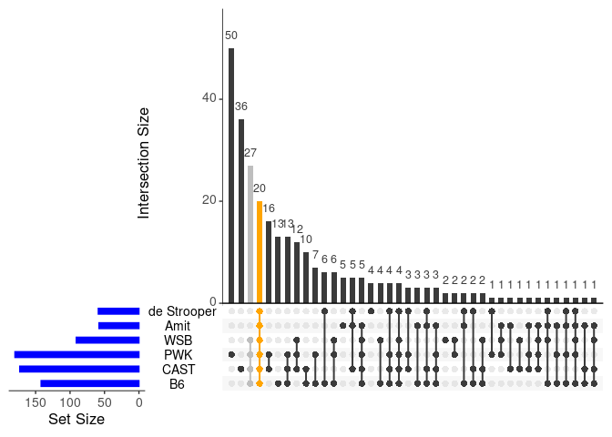<!-- -->

```r
png(filename = file_name, width = 8, height = 4.5, units = "in", res = 300)
x
dev.off()
```

```
## png 
##   2
```

### Export intersecting DAM6 gene list: 

```r
### Upset plot 1: DAM6 overlapping with Amit DAM & Strooper ARM

## Because this upset has 6 lists, so venn() function in gplots package doesn't work. use Vennerable for up to 9 sets

#library(devtools)
#install_github("js229/Vennerable")
library(Vennerable)


tmp <- Venn(DE_cluster_list)
# view elements:
tmp@IntersectionSets$`111111` ## all overlap
```

```
##  [1] "Cst7"   "Clec7a" "Tyrobp" "Cd52"   "Apoe"   "Ctsd"   "Lpl"   
##  [8] "Axl"    "Ank"    "Npc2"   "Ctsb"   "Fth1"   "Ccl3"   "Cd63"  
## [15] "Ccl6"   "Rps24"  "Ctsz"   "Rps14"  "B2m"    "Cd9"
```

```r
tmp@IntersectionSets$`111100` ## B6,CAST,PWK,WSB overlap, but not in Strooper/Amit
```

```
##  [1] "Gapdh"     "Rps2"      "Rps19"     "Uba52"     "Rpl13a"   
##  [6] "Rps18"     "Rpl26"     "Rps4x"     "Cd74"      "Rpl6"     
## [11] "Rps11"     "Rpl29"     "Rpl36"     "Rpl18"     "Rps10"    
## [16] "Gnb2l1"    "Rpl22"     "Tpt1"      "Rpl7"      "Rps25"    
## [21] "Eef1b2"    "Rps15"     "Rps23-ps1" "Rpl3"      "Rpl9"     
## [26] "Rps9"      "Cstb"
```

```r
tmp@IntersectionSets$`010011` ## Strooper&Amit, & CAST 
```

```
## [1] "Cadm1" "Ctsa"  "Cd83"  "H2-D1" "H2-K1"
```

```r
tmp@IntersectionSets$`110011` ## Strooper&Amit, & CAST&B6
```

```
## [1] "Trem2" "Gusb"  "Hexa"
```

```r
tmp@IntersectionSets$`100011` ## Strooper&Amit, & B6
```

```
## [1] "Cd68" "Ctsl"
```

```r
tmp@IntersectionSets$`100111` ## Strooper&Amit, & B6 & WSB
```

```
## [1] "Capg"
```

```r
tmp@IntersectionSets$`110111` ## Strooper&Amit, & B6 & WSB & CAST
```

```
## [1] "Lyz2"
```

```r
tmp@IntersectionSets$`101111` ## Strooper&Amit, & B6 & WSB & PWK
```

```
## [1] "Rpl23"
```

```r
tmp@IntersectionSets$`101011` ## Strooper&Amit, & B6 & PWK
```

```
## [1] "Serpine2"
```

```r
tmp@IntersectionSets$`111011` ## Strooper&Amit, & B6 & PWK & CAST
```

```
## [1] "Lgals3bp"
```

```r
# save core DAM6 genes for score evaluation 
core_DAM6 <- tmp@IntersectionSets$`111111` 
# upset_DAM1 <- tmp
#write_delim(DE_cluster_intersect, paste(output_path, "upset_", comp, "_intersect.txt", sep = ""), delim = "\t")
```


### load seurat object to add module scores based on core genes of DAM 6 

```r
cd11b.integrated <- readRDS("../02_data/intermediate_rds/mg_int.rds") 

## combine homeostatic microglia
cd11b.integrated$final_clusters <-  ifelse(cd11b.integrated$seurat_clusters %in% 0:5,"H",
                                           cd11b.integrated$seurat_clusters %>% as.character())
cd11b.integrated$final_clusters <- factor(cd11b.integrated$final_clusters, 
                                          levels = c("H", "6", "7", "8", "9", "10", "11", "12"))
cd11b.integrated$Genotype <- factor(cd11b.integrated$Genotype, levels = c("WT", "APP/PS1"))

cd11b.integrated$Strain <- gsub("B6J", "B6", cd11b.integrated$Strain)
cd11b.integrated$Strain <- factor(cd11b.integrated$Strain, levels = c("B6", "CAST", "PWK", "WSB"))

cd11b.integrated$Group <- gsub("B6J", "B6", cd11b.integrated$Group)

cd11b.integrated$Group <- factor(cd11b.integrated$Group, 
                                 levels=c("B6_WT", "B6_APP/PS1", "CAST_WT", "CAST_APP/PS1", "PWK_WT","PWK_APP/PS1", "WSB_WT", "WSB_APP/PS1"))
```


### add module score for all core clusters (DAM/ARM, IRM/Aging_OA3, Aging_OA2)

```r
cd11b.integrated <- AddModuleScore(object = cd11b.integrated, features = list(core_DAM6), ctrl = 100, name = 'core_DAM6') 
```


#### plot

```r
meta <- cd11b.integrated@meta.data

clusters <- levels(meta$final_clusters) %>% as.list()

cbPalette <- c("#999999", "#E69F00", "#56B4E9", "#009E73", "#F0E442", "#0072B2", "#D55E00", "#CC79A7") # color blind friendly Palette (grey)
```

### List examples of marker genes of all kinds splits by strain and genotype

### DAM 

```r
genes <- c("Cst7", "Clec7a", "Cd9", "Lpl", "Apoe","Cadm1", "Ctsa", "Trem2", "Cd68", "Ctsl", "Capg", "Serpine2")

library(extrafont)
#font_import()

Idents(cd11b.integrated) <- "Strain"
p <- genes %>% 
  map(~VlnPlot(cd11b.integrated %>% subset(subset=final_clusters %in% c("6")), features = ., pt.size = 0, split.by = "Genotype", ncol = 4, cols =  c("#E69F00", "#999999")) + 
        theme(legend.position = "none", 
              axis.title = element_blank(), 
              axis.text.x = element_text(size = 8),
              axis.text.y = element_text(size = 10), 
              title = element_text(size = 10, family = "Arial")
              )) 

plot_grid(p[[1]], p[[2]], p[[3]], p[[4]], p[[5]], p[[6]], p[[7]], p[[8]], p[[9]], p[[10]], p[[11]], p[[12]], align = c("hv"), nrow =2, ncol = 6)
```

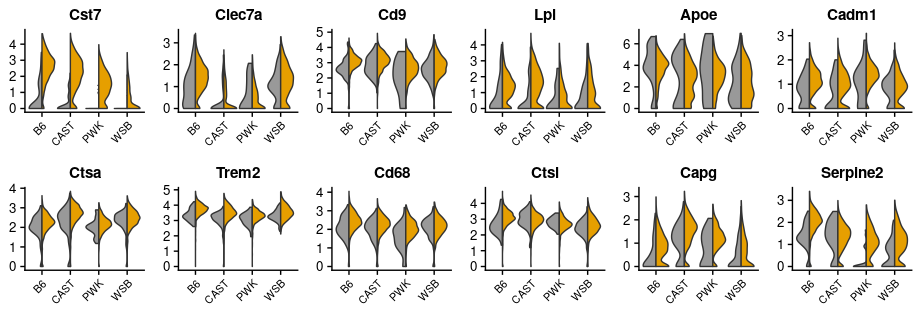<!-- -->

```r
ggsave(paste(output_path, "Vln_gene_", comp, ".png", sep = ""), dpi = 300, width = 9.6, height = 3.3)

# just plot a gene figure with the legend
x <- VlnPlot(cd11b.integrated %>% subset(subset=final_clusters %in% c("6")), features = "Lpl", pt.size = 0, split.by = "Genotype", ncol = 4, cols =  c("#E69F00", "#999999"))

ggsave(paste(output_path, "Vln_lpl_", comp, ".png", sep = ""), x, dpi = 300, width = 8, height = 3.3)
```


## Upset plot 1.1 : Cluster12 overlapping with Amit and de Strooper

```r
comp <- "DAM12_Amit_Strooper"
DE_cluster_list <- DE_DAM12_list

DE_cluster_list[["Amit"]] <- gene_DAM
DE_cluster_list[["de Strooper"]] <- gene_ARM 

file_name <- paste(output_path, "upset_", comp, ".png", sep = "")

x <- upset(fromList(DE_cluster_list), 
      nsets = length(DE_cluster_list), 
      sets = names(DE_cluster_list),
      queries = list(list(query = intersects, params = list(names(DE_cluster_list)), color = "orange", active = TRUE),
                     list(query = intersects, params = list(names(DE_cluster_list)[-5:-6]), color = "grey", active = TRUE)),
      order.by = "freq",
      keep.order = TRUE,
      sets.bar.color = "blue", text.scale=1.5)
x
```

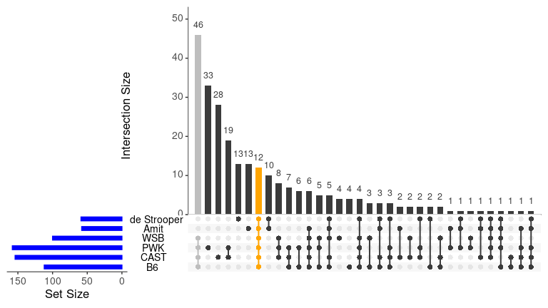<!-- -->

```r
png(filename = file_name, width = 8, height = 4.5, units = "in", res = 300)
x
dev.off()
```

```
## png 
##   2
```

### Export intersecting DAM12 gene list: 

```r
library(Vennerable)

tmp <- Venn(DE_cluster_list)
# view elements:
tmp@IntersectionSets$`111111` ## all overlap
```

```
##  [1] "Tyrobp" "Fth1"   "Cst7"   "Rps24"  "Cd52"   "Rps14"  "Npc2"  
##  [8] "Cd63"   "Clec7a" "Ctsz"   "Ccl6"   "B2m"
```

```r
tmp@IntersectionSets$`111100` ## B6,CAST,PWK,WSB overlap, but not in de Strooper/Amit
```

```
##  [1] "Rps2"       "Rps19"      "Rps4x"      "Tpt1"       "Rpl26"     
##  [6] "Rps11"      "Gnb2l1"     "Gapdh"      "Rpl13a"     "Rpsa"      
## [11] "Rpl29"      "Rps10"      "Rps18"      "Rps9"       "Rps15"     
## [16] "Rps26"      "Rps3"       "Rpl6"       "Rpl7"       "Rpl22"     
## [21] "Uba52"      "Tmsb4x"     "Rps23-ps1"  "Rps25"      "Rpl8"      
## [26] "Gng5"       "Rpl19-ps11" "Cox8a"      "Cox4i1"     "Rpl14"     
## [31] "Eef1b2"     "Atox1"      "Rps15a"     "Rpl18"      "Uqcrh"     
## [36] "Rpl36"      "Atp5e"      "Rpl9"       "Rps13"      "Rpl37"     
## [41] "Ssr4"       "Rpl30"      "Rps29"      "Pfdn5"      "Rpl4"      
## [46] "Atp6v0c"
```

```r
tmp@IntersectionSets$`000011` ## Not in B6,CAST,PWK,WSB overlap, but in de Strooper/Amit
```

```
##  [1] "H2-D1"    "Serpine2" "Lgals3bp" "H2-K1"    "Ctsl"     "Cd68"    
##  [7] "Gusb"     "Cd83"     "Hexa"     "Ctsa"
```

```r
tmp@IntersectionSets$`110111` ## Strooper&Amit, & B6 & WSB & CAST
```

```
## [1] "Lyz2" "Ctsd" "Ccl3" "Lpl"  "Ctsb"
```

```r
tmp@IntersectionSets$`110011` ## Strooper&Amit, & CAST & B6
```

```
## [1] "Trem2" "Ank"   "Capg"
```

```r
tmp@IntersectionSets$`001011` ## Strooper&Amit, & PWK
```

```
## [1] "Axl"
```

```r
tmp@IntersectionSets$`010011` ## Strooper&Amit, & CAST
```

```
## [1] "Cadm1"
```

```r
tmp@IntersectionSets$`110011` ## Strooper&Amit, & CAST&B6
```

```
## [1] "Trem2" "Ank"   "Capg"
```

```r
tmp@IntersectionSets$`011111` ## Strooper&Amit, & CAST & PWK & WSB
```

```
## [1] "Cd9"
```

```r
tmp@IntersectionSets$`101111` ## Strooper&Amit, & B6 & PWK & WSB
```

```
## [1] "Rpl23"
```

```r
tmp@IntersectionSets$`111011` ## Strooper&Amit, & B6 & PWK & CAST
```

```
## [1] "Apoe"
```

```r
# save core DAM6 genes for score evaluation 
core_DAM12 <- tmp@IntersectionSets$`111111` 
# upset_DAM1 <- tmp
#write_delim(DE_cluster_intersect, paste(output_path, "upset_", comp, "_intersect.txt", sep = ""), delim = "\t")
```
### add module score for all core genes of cluster 12

```r
cd11b.integrated <- AddModuleScore(object = cd11b.integrated, features = list(core_DAM12), ctrl = 100, name = 'core_DAM12') 
```


### List examples of marker genes of all kinds splits by strain and genotype
### DAM12

```r
genes <- c("Tyrobp", "Cst7", "Clec7a", "Ccl6", "B2m", "Ctsd", "Ccl3", "Lpl", "Trem2", "Axl", "Cd9", "Apoe")

library(extrafont)
#font_import()

Idents(cd11b.integrated) <- "Strain"
p <- genes %>% 
  map(~VlnPlot(cd11b.integrated %>% subset(subset=final_clusters %in% c("12")), features = ., pt.size = 0, split.by = "Genotype", ncol = 4, cols =  c("#E69F00", "#999999")) + 
        theme(legend.position = "none", 
              axis.title = element_blank(), 
              axis.text.x = element_text(size = 8),
              axis.text.y = element_text(size = 10), 
              title = element_text(size = 10, family = "Arial")
              )) 

plot_grid(p[[1]], p[[2]], p[[3]], p[[4]], p[[5]], p[[6]], p[[7]], p[[8]], p[[9]], p[[10]], p[[11]], p[[12]], align = c("hv"), nrow =2, ncol = 6)
```

<!-- -->

```r
ggsave(paste(output_path, "Vln_gene_", comp, ".png", sep = ""), dpi = 300, width = 9.6, height = 3.3)
```


## Upset plot 2: IRM7 overlapping with Strooper IRM & Stevens Aging_OA3

```r
comp <- "IRM7_Strooper_Stevens"
DE_cluster_list <- DE_IRM_list

DE_cluster_list[["de Strooper"]] <- gene_IRM
DE_cluster_list[["Stevens"]] <- gene_OA3

file_name <- paste(output_path, "upset_", comp, ".png", sep = "")

x <- upset(fromList(DE_cluster_list), 
      nsets = length(DE_cluster_list), 
      sets = names(DE_cluster_list),
      queries = list(list(query = intersects, params = list(names(DE_cluster_list)), color = "orange", active = TRUE)),
      order.by = "freq",
      keep.order = TRUE,
      sets.bar.color = "blue", text.scale=1.5)
x
```

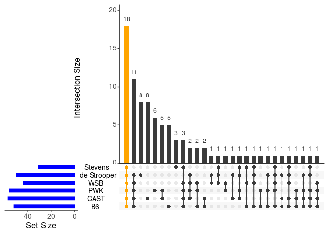<!-- -->

```r
png(filename = file_name, width = 8, height = 4.5, units = "in", res = 300)
x
dev.off()
```

```
## png 
##   2
```

### Export intersecting IRM7 gene list: 

```r
tmp <- Venn(DE_cluster_list)
# view elements:
tmp@IntersectionSets$`111111` ## all overlap
```

```
##  [1] "Rtp4"     "Ifit3"    "Ifitm3"   "Slfn2"    "Bst2"     "Oasl2"   
##  [7] "Stat1"    "Ly6e"     "Usp18"    "Xaf1"     "Irf7"     "Trim30a" 
## [13] "Sp100"    "Lgals3bp" "Phf11b"   "Phf11d"   "H2-K1"    "B2m"
```

```r
tmp@IntersectionSets$`111110` ## B6,CAST,PWK,WSB overlap with Strooper but not Stevens
```

```
##  [1] "Parp14"  "Eif2ak2" "Ifit2"   "Ifit3b"  "Slfn5"   "Oas1g"   "Rnf213" 
##  [8] "Zbp1"    "Mx1"     "Slfn8"   "Herc6"
```

```r
tmp@IntersectionSets$`111101` ## B6,CAST,PWK,WSB overlap with Strooper but not Stevens
```

```
## [1] "Isg15"  "Pyhin1" "Ifit1"
```

```r
tmp@IntersectionSets$`000111` ## Strooper/Stevens marker, WSB only
```

```
## [1] "Oas1a"
```

```r
tmp@IntersectionSets$`100111` ## Strooper/Stevens marker, WSB & B6
```

```
## [1] "Ccl12"
```

```r
tmp@IntersectionSets$`011011` ## Strooper/Stevens marker, PWK & CAST
```

```
## [1] "H2-D1"
```

```r
tmp@IntersectionSets$`101111` ## Strooper/Stevens marker, WSB & B6 & PWK, not CAST
```

```
## [1] "Tor3a"
```

```r
tmp@IntersectionSets$`111011` ## Strooper/Stevens marker, CAST & B6 & PWK, not WSB
```

```
## [1] "Ifi204"
```

```r
tmp@IntersectionSets$`110111` ## Strooper/Stevens marker, WSB & B6 & CAST, not PWK
```

```
## [1] "Ifi27l2a"
```

```r
# save core IRM7 genes for score evaluation 
core_IRM7 <- tmp@IntersectionSets$`111111` 
```

### add module score for core markers IRM/Aging_OA3

```r
cd11b.integrated <- AddModuleScore(object = cd11b.integrated, features = list(core_IRM7), ctrl = 100, name = 'core_IRM7') 
```


### List examples of marker genes of all kinds splits by strain and genotype

### IRM 

```r
genes <- c("Rtp4", "Ifit3", "Ifitm3", "Irf7", "Bst2", "Oasl2", "Trim30a", "Stat1", "Oas1a", "Ccl12", "Tor3a", "Ifi204")

#library(extrafont)
#font_import()

Idents(cd11b.integrated) <- "Strain"
p <- genes %>% 
  map(~VlnPlot(cd11b.integrated %>% subset(subset=final_clusters %in% c("7")), features = ., pt.size = 0, split.by = "Genotype", ncol = 4, cols =  c("#E69F00", "#999999")) + 
        theme(legend.position = "none", 
              axis.title = element_blank(), 
              axis.text.x = element_text(size = 8),
              axis.text.y = element_text(size = 10), 
              title = element_text(size = 10, family = "Arial")
              )) 

plot_grid(p[[1]], p[[2]], p[[3]], p[[4]], p[[5]], p[[6]], p[[7]], p[[8]], p[[9]], p[[10]], p[[11]], p[[12]], align = ("hv"), nrow =2, ncol = 6)
```

<!-- -->

```r
ggsave(paste(output_path, "Vln_gene_", comp, ".png", sep = ""), dpi = 300, width = 9.6, height = 3.3)
```


## Upset plot 3: cluster10 overlapping with Stevens Aging_OA2

```r
comp <- "cl10_Stevens_OA2"
DE_cluster_list <- DE_cl10_list

DE_cluster_list[["Stevens"]] <- gene_OA2

file_name <- paste(output_path, "upset_", comp, ".png", sep = "")

x <- upset(fromList(DE_cluster_list), 
      nsets = length(DE_cluster_list), 
      sets = names(DE_cluster_list),
      queries = list(list(query = intersects, params = list(names(DE_cluster_list)), color = "orange", active = TRUE)),
      order.by = "freq",
      keep.order = TRUE,
      sets.bar.color = "blue", text.scale=1.5)
x
```

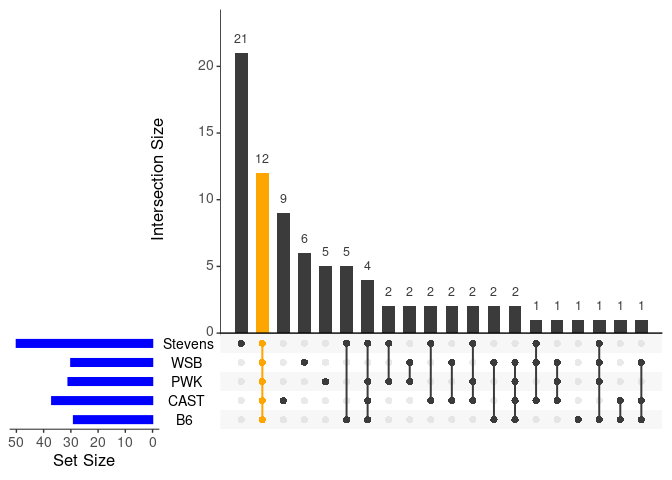<!-- -->

```r
png(filename = file_name, width = 8, height = 4.5, units = "in", res = 300)
x
dev.off()
```

```
## png 
##   2
```

### Export intersecting cluster10 gene list: 

```r
tmp <- Venn(DE_cluster_list)
# view elements:
tmp@IntersectionSets$`11111` ## all overlap
```

```
##  [1] "Cd63"  "Ctsz"  "Cd9"   "Ctsb"  "Ccl3"  "Ccl4"  "Ctsd"  "Ftl1" 
##  [9] "Cstb"  "Cd83"  "C3ar1" "Atf3"
```

```r
tmp@IntersectionSets$`11110` ## B6,CAST,PWK,WSB overlap, but not in Stevens
```

```
## [1] "Atp6v0c" "Cyba"
```

```r
tmp@IntersectionSets$`00001` ## Not in B6,CAST,PWK,WSB overlap, but in Stevens
```

```
##  [1] "Spp1"   "Gpr84"  "Ccl12"  "Cst7"   "Apoe"   "Cd52"   "B2m"   
##  [8] "Capg"   "Mmp12"  "Ccl6"   "H2-D1"  "Rps2"   "Pkm"    "H2-K1" 
## [15] "Id2"    "Ccl9"   "Gnas"   "Fam20c" "Pdcd1"  "Cd14"   "Ldha"
```

```r
tmp@IntersectionSets$`10001` ## Stevens, & B6
```

```
## [1] "Lgals3"  "Lpl"     "Lilrb4a" "Cxcl16"  "Bcl2a1b"
```

```r
tmp@IntersectionSets$`11101` ## Stevens, & B6 & PWK & CAST
```

```
## [1] "Gapdh" "Cd68"  "Mif"   "Fth1"
```

```r
tmp@IntersectionSets$`00101` ## Stevens, & PWK
```

```
## [1] "Tlr2"  "Ch25h"
```

```r
tmp@IntersectionSets$`01001` ## Stevens, & CAST
```

```
## [1] "Aldoa" "C5ar1"
```

```r
tmp@IntersectionSets$`01101` ## Stevens, & CAST & PWK
```

```
## [1] "Prdx1"  "Cox6a2"
```

```r
tmp@IntersectionSets$`01011` ## Stevens, & CAST & WSB
```

```
## [1] "Lyz2"
```

```r
tmp@IntersectionSets$`10111` ## Stevens, & B6 & PWK & WSB
```

```
## [1] "Eif4a1"
```

```r
# save core DAM6 genes for score evaluation 
core_cluster10 <- tmp@IntersectionSets$`11111` 
```

### add module score for core markers cluster 10/ Aging_OA2

```r
cd11b.integrated <- AddModuleScore(object = cd11b.integrated, features = list(core_cluster10), ctrl = 100, name = 'core_cluster10') 
```


### Cluster 10 gene violin plots in each strain and genotype

```r
genes <- c("Ccl3", "Ccl4", "Cd83", "C3ar1", "Atf3", "Lpl", "Lgals3", "Cd68", "Tlr2", "C5ar1", "Prdx1", "Lyz2")

#library(extrafont)
#font_import()

Idents(cd11b.integrated) <- "Strain"
p <- genes %>% 
  map(~VlnPlot(cd11b.integrated %>% subset(subset=final_clusters %in% c("10")), features = ., pt.size = 0, split.by = "Genotype", ncol = 4, cols =  c("#E69F00", "#999999")) + 
        theme(legend.position = "none", 
              axis.title = element_blank(), 
              axis.text.x = element_text(size = 8),
              axis.text.y = element_text(size = 10), 
              title = element_text(size = 10, family = "Arial")
              )) 

plot_grid(p[[1]], p[[2]], p[[3]], p[[4]], p[[5]], p[[6]], p[[7]], p[[8]], p[[9]], p[[10]], p[[11]], p[[12]], align = ("hv"), nrow =2, ncol = 6)
```

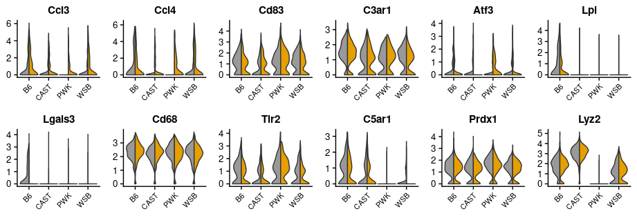<!-- -->

```r
ggsave(paste(output_path, "Vln_gene_", comp, ".png", sep = ""), dpi = 300, width = 9.6, height = 3.3)
```

#### Homeostatic microglia expression

Homoestatic marker paper: 
Amit, Stooper, Stevens.
Christoph glass: https://science.sciencemag.org/content/early/2017/05/24/science.aal3222?versioned=true
Oleg : https://www.nature.com/articles/s41583-018-0057-5


```r
gene_homeo <- c("Tmem119", "Cx3cr1", "P2ry12", "P2ry13", "Hexb", "Olfml3",  "Selplg", "Siglech", "Csf1r", "Cst3", "Sparc", "C1qa", "C1qb", "C1qc", "Tmsb4x", "Sall1", "Fcrls", "Gpr34", "Spi1",  "Mafb", "Maf", "Mef2a", "Irf8")
```


```r
cd11b.integrated <- AddModuleScore(object = cd11b.integrated, features = list(gene_homeo), ctrl = 100, name = 'homeo') 
```


```r
meta <- cd11b.integrated@meta.data
saveRDS(meta, paste(output_path, "meta_mouse_strain_score.rds", sep = ""))
```


### homeostatic microglia markers

```r
genes <- c("Tmem119", "Cx3cr1", "P2ry12", "Sall1", "Gpr34", "Spi1",  "Mafb", "Maf", "Mef2a", "Irf8",  "Fcrls", "Olfml3")


Idents(cd11b.integrated) <- "Strain"
p <- genes %>% 
  map(~VlnPlot(cd11b.integrated %>% subset(subset=final_clusters %in% c("H")), features = ., pt.size = 0, split.by = "Genotype", ncol = 4, cols =  c("#E69F00", "#999999")) + 
        theme(legend.position = "none", 
              axis.title = element_blank(), 
              axis.text.x = element_text(size = 8),
              axis.text.y = element_text(size = 10), 
              title = element_text(size = 10, family = "Arial")
              )) 

plot_grid(p[[1]], p[[2]], p[[3]], p[[4]], p[[5]], p[[6]], p[[7]], p[[8]], p[[9]], p[[10]], 
          p[[11]], p[[12]],
          align = ("hv"), nrow =3, ncol = 4)
```

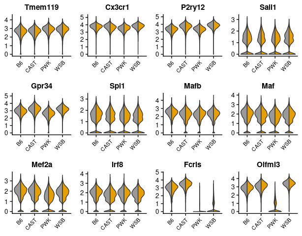<!-- -->

```r
# width = 8, height = 3.3 2x5

ggsave(paste(output_path, "Vln_gene_", comp, ".png", sep = ""), dpi = 300, width = 6.4, height = 5)
```

## z-score plotting using split violin and grouped by cluster

```r
# can run this chunck without runing previous chuncks
library(tidyverse)

meta <- readRDS(paste(output_path, "meta_mouse_strain_score.rds", sep = ""))
source("~/code/wild_AD_mic_scRNA/05_function/split_ViolinBox_plot.R")

cbPalette <- c("#999999", "#E69F00", "#56B4E9", "#009E73", "#F0E442", "#0072B2", "#D55E00", "#CC79A7") # color blind friendly Palette (grey)

## plot Homoestatic microglia z-score
comp <- "homeo1"
cluster <- c("H", "8", "6")
strain <- c("B6", "CAST", "PWK", "WSB") %>% rev()
width_height <- c(3, 5)

meta %>%
  filter(final_clusters %in% cluster) %>% 
  mutate(final_clusters = factor(final_clusters, levels = cluster),
         Strain = factor(Strain, levels = strain)) %>% 
  ggplot(aes(y=homeo1, x= Strain, fill= Genotype)) +   # change y to the same as comp but no quotation mark
    facet_grid(final_clusters ~ ., scales= "fixed") +
    geom_split_violin(trim = TRUE) +
    geom_boxplot(width = 0.25, notch = FALSE, notchwidth = .4, outlier.shape = NA, coef=0)+
    scale_fill_manual(values=cbPalette) + 
    coord_flip() +
    theme_bw()+
    labs(x=NULL, y="z-score") +
    theme(legend.position = "bottom", 
          strip.text = element_text(face = "bold", size = 12, family = "Arial"),
          axis.text = element_text(size = 10), 
          axis.text.y = element_text(face = "bold"),
          axis.title.x = element_text(face = "bold", size = 12))
```

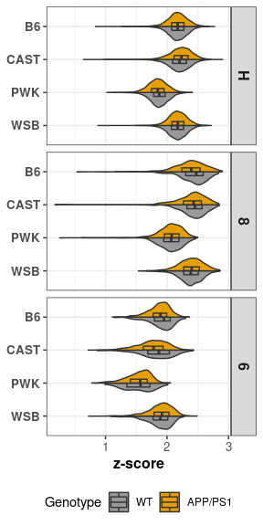<!-- -->

```r
ggsave(paste(output_path, "Vln2_", comp, ".png", sep = ""), dpi = 300, width = width_height[1], height = width_height[2])


## plot DAM6 features
comp <- "core_DAM61"
cluster <- c("H", "6")
strain <- c("B6", "CAST", "PWK", "WSB") %>% rev()
width_height <- c(2.5, 5)

meta %>%
  filter(final_clusters %in% cluster) %>% 
  mutate(final_clusters = factor(final_clusters, levels = cluster),
         Strain = factor(Strain, levels = strain)) %>% 
  ggplot(aes(y=core_DAM61, x= Strain, fill= Genotype)) +   # change y to the same as comp but no quotation mark
    facet_grid(final_clusters ~ ., scales= "fixed") +
    geom_split_violin(trim = TRUE) +
    geom_boxplot(width = 0.25, notch = FALSE, notchwidth = .4, outlier.shape = NA, coef=0)+
    scale_fill_manual(values=cbPalette) + 
    coord_flip() +
    theme_bw()+
    labs(x=NULL, y="z-score") +
    theme(legend.position = "bottom", 
          strip.text = element_text(face = "bold", size = 12, family = "Arial"),
          axis.text = element_text(size = 10), 
          axis.text.y = element_text(face = "bold"),
          axis.title.x = element_text(face = "bold", size = 12))
```

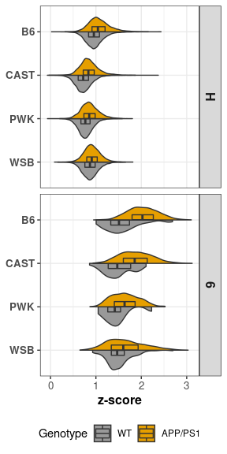<!-- -->

```r
ggsave(paste(output_path, "Vln2_", comp, ".png", sep = ""), dpi = 300, width = width_height[1], height = width_height[2])

## plot IRM7 features
comp <- "core_IRM71"
cluster <- c("H", "7")
strain <- c("B6", "CAST", "PWK", "WSB") %>% rev()
width_height <- c(2.5, 5)

meta %>%
  filter(final_clusters %in% cluster) %>% 
  mutate(final_clusters = factor(final_clusters, levels = cluster),
         Strain = factor(Strain, levels = strain)) %>% 
  ggplot(aes(y=core_IRM71, x= Strain, fill= Genotype)) +   # change y to the same as comp but no quotation mark
    facet_grid(final_clusters ~ ., scales= "fixed") +
    geom_split_violin(trim = TRUE) +
    geom_boxplot(width = 0.25, notch = FALSE, notchwidth = .4, outlier.shape = NA, coef=0)+
    scale_fill_manual(values=cbPalette) + 
    coord_flip() +
    theme_bw()+
    labs(x=NULL, y="z-score") +
    theme(legend.position = "bottom", 
          strip.text = element_text(face = "bold", size = 12, family = "Arial"),
          axis.text = element_text(size = 10), 
          axis.text.y = element_text(face = "bold"),
          axis.title.x = element_text(face = "bold", size = 12))
```

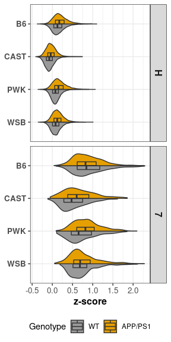<!-- -->

```r
ggsave(paste(output_path, "Vln2_", comp, ".png", sep = ""), dpi = 300, width = width_height[1], height = width_height[2])


## plot DAM12 features
comp <- "core_DAM121"
cluster <- c("H", "12")
strain <- c("B6", "CAST", "PWK", "WSB") %>% rev()
width_height <- c(2.5, 5)

meta %>%
  filter(final_clusters %in% cluster) %>% 
  mutate(final_clusters = factor(final_clusters, levels = cluster),
         Strain = factor(Strain, levels = strain)) %>% 
  ggplot(aes(y=core_DAM121, x= Strain, fill= Genotype)) +   # change y to the same as comp but no quotation mark
    facet_grid(final_clusters ~ ., scales= "fixed") +
    geom_split_violin(trim = TRUE) +
    geom_boxplot(width = 0.25, notch = FALSE, notchwidth = .4, outlier.shape = NA, coef=0)+
    scale_fill_manual(values=cbPalette) + 
    coord_flip() +
    theme_bw()+
    labs(x=NULL, y="z-score") +
    theme(legend.position = "bottom", 
          strip.text = element_text(face = "bold", size = 12, family = "Arial"),
          axis.text = element_text(size = 10), 
          axis.text.y = element_text(face = "bold"),
          axis.title.x = element_text(face = "bold", size = 12))
```

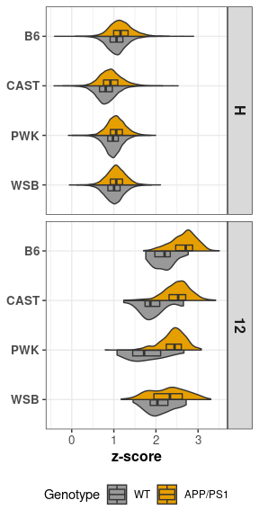<!-- -->

```r
ggsave(paste(output_path, "Vln2_", comp, ".png", sep = ""), dpi = 300, width = width_height[1], height = width_height[2])


## plot cluster 10 features
comp <- "core_cluster101"
cluster <- c("H", "10")
strain <- c("B6", "CAST", "PWK", "WSB") %>% rev()
width_height <- c(2.5, 5)

meta %>%
  filter(final_clusters %in% cluster) %>% 
  mutate(final_clusters = factor(final_clusters, levels = cluster),
         Strain = factor(Strain, levels = strain)) %>% 
  ggplot(aes(y=core_cluster101, x= Strain, fill= Genotype)) +   # change y to the same as comp but no quotation mark
    facet_grid(final_clusters ~ ., scales= "fixed") +
    geom_split_violin(trim = TRUE) +
    geom_boxplot(width = 0.25, notch = FALSE, notchwidth = .4, outlier.shape = NA, coef=0)+
    scale_fill_manual(values=cbPalette) + 
    coord_flip() +
    theme_bw() +
    labs(x=NULL, y="z-score") +
    theme(legend.position = "bottom", 
          strip.text = element_text(face = "bold", size = 12, family = "Arial"),
          axis.text = element_text(size = 10), 
          axis.text.y = element_text(face = "bold"),
          axis.title.x = element_text(face = "bold", size = 12))
```

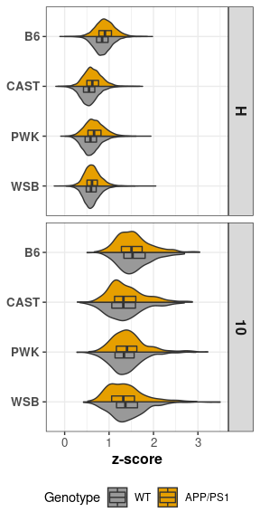<!-- -->

```r
ggsave(paste(output_path, "Vln2_", comp, ".png", sep = ""), dpi = 300, width = width_height[1], height = width_height[2])
```

### convert overlapping genes into gene list

```r
DE_cluster_ls_ls <- vector(mode = "list") # make a big list to store each intersection list

# DAM6
comp <- "DAM6_Amit_Strooper"
DE_cluster_list <- DE_DAM6_list
DE_cluster_list[["Amit"]] <- gene_DAM
DE_cluster_list[["de_Strooper"]] <- gene_ARM 
DE_cluster_ls_ls[[comp]] <- DE_cluster_list

# DAM12
comp <- "DAM12_Amit_Strooper"
DE_cluster_list <- DE_DAM12_list
DE_cluster_list[["Amit"]] <- gene_DAM
DE_cluster_list[["de_Strooper"]] <- gene_ARM 
DE_cluster_ls_ls[[comp]] <- DE_cluster_list

# IRM7
comp <- "IRM7_Strooper_Stevens"
DE_cluster_list <- DE_IRM_list
DE_cluster_list[["de_Strooper"]] <- gene_IRM
DE_cluster_list[["Stevens"]] <- gene_OA3
DE_cluster_ls_ls[[comp]] <- DE_cluster_list

#cluster10
comp <- "cl10_Stevens_OA2"
DE_cluster_list <- DE_cl10_list
DE_cluster_list[["Stevens"]] <- gene_OA2
DE_cluster_ls_ls[[comp]] <- DE_cluster_list

names(DE_cluster_ls_ls)
```

```
## [1] "DAM6_Amit_Strooper"    "DAM12_Amit_Strooper"   "IRM7_Strooper_Stevens"
## [4] "cl10_Stevens_OA2"
```

```r
source("~/code/wild_AD_mic_scRNA/05_function/venn_intersects_upgrade.R")

intersect_table_list <- map(DE_cluster_ls_ls, venn_intersects_upgrade)

for (i in seq_along(intersect_table_list)){
  intersect_table_list[[i]] <- intersect_table_list[[i]] %>% 
    mutate(Orig_Symbol=as.character(Orig_Symbol),
           Intersections=paste("Intersection", as.character(Intersections), sep="_"))
}

walk2(intersect_table_list, paste(output_path, "Interset_", names(DE_cluster_ls_ls), ".txt", sep = ""), write_delim, delim="\t")
```
