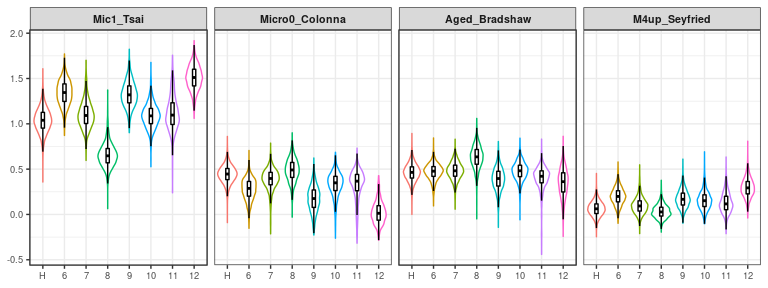
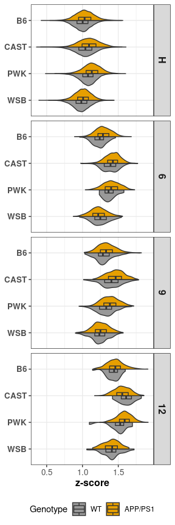
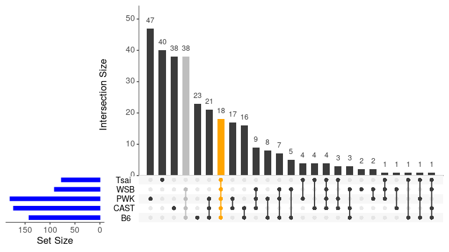

```r
knitr::opts_chunk$set(warning=FALSE, message=FALSE)
```


```r
library(tidyverse)
library(Seurat)
library(patchwork)
```


#### Load Seurat object (our mouse data of 4 strains)


```r
output_path <- "../03_results/07c_mic_compare_strain_human/"

cd11b.integrated <- readRDS("../02_data/intermediate_rds/mg_int.rds") 

## combine homeostatic microglia
cd11b.integrated$final_clusters <-  ifelse(cd11b.integrated$seurat_clusters %in% 0:5,"H",
                                           cd11b.integrated$seurat_clusters %>% as.character())
cd11b.integrated$final_clusters <- factor(cd11b.integrated$final_clusters, 
                                          levels = c("H", "6", "7", "8", "9", "10", "11", "12"))
cd11b.integrated$Genotype <- factor(cd11b.integrated$Genotype, levels = c("WT", "APP/PS1"))

cd11b.integrated$Strain <- gsub("B6J", "B6", cd11b.integrated$Strain)
cd11b.integrated$Strain <- factor(cd11b.integrated$Strain, levels = c("B6", "CAST", "PWK", "WSB"))

cd11b.integrated$Group <- gsub("B6J", "B6", cd11b.integrated$Group)

cd11b.integrated$Group <- factor(cd11b.integrated$Group, 
                                 levels=c("B6_WT", "B6_APP/PS1", "CAST_WT", "CAST_APP/PS1", "PWK_WT","PWK_APP/PS1", "WSB_WT", "WSB_APP/PS1"))
```


### Four human microglia datasets to compare against

#### Tsai dataset
Single-cell transcriptomic analysis of Alzheimer’s disease (single nuc-RNA-seq)
https://www.nature.com/articles/s41586-019-1195-2#MOESM9
Mic1 population is Alzheimer's associated (Table S7 in the original paper)

```r
url <- "https://static-content.springer.com/esm/art%3A10.1038%2Fs41586-019-1195-2/MediaObjects/41586_2019_1195_MOESM9_ESM.xlsx"

destfile <- "../02_data/mic_human/Tsia_AD_Mic1_ST7.xlsx"

if (!file.exists(destfile)) 
  download.file(url = url, destfile = destfile)

df_Mic1 <- readxl::read_excel(destfile, sheet = "Overlap Mic1 and DAM", skip = 1)

gene_Mic1 <- c(df_Mic1[[1]] %>% unlist(), df_Mic1[[2]] %>% unlist())
gene_Mic1 <- gene_Mic1[!is.na(gene_Mic1)] %>% str_to_sentence() # There are no p-val and FC. Take all 77 into account
```

#### Colonna dataset
Human and mouse single-nucleus transcriptomics reveal TREM2-dependent and TREM2-independent cellular responses in Alzheimer’s disease (single nuc-RNA-seq)
https://www.nature.com/articles/s41591-019-0695-9#Sec45
Micro0 population is Alzheimer's associated (Supplemental table 4) 


```r
url <- "https://static-content.springer.com/esm/art%3A10.1038%2Fs41591-019-0695-9/MediaObjects/41591_2019_695_MOESM2_ESM.xlsx"
destfile <- "../02_data/mic_human/Colonna_TREM_ST4.xlsx"

if (!file.exists(destfile)) 
  download.file(url = url, destfile = destfile)

# get top 41 genes by: -log10(p_val_adj)>6, avg_logFC>0.5
df_Micro0 <- readxl::read_excel(destfile, sheet = "Micro0_Cluster_Marker", skip = 3)
gene_Micro0 <- df_Micro0 %>% filter(-log10(p_val_adj)>6, avg_logFC>0.5) %>% arrange(desc(-log10(p_val_adj))) %>%  select(gene) %>% unlist() %>% str_to_sentence()
```

#### Bradshaw dataset
A transcriptomic atlas of aged human microglia (bulk RNA-seq on aged human microglia)
https://www.nature.com/articles/s41467-018-02926-5
HuMi_Aged gene set (Supplementary Data 1)


```r
url <- "https://static-content.springer.com/esm/art%3A10.1038%2Fs41467-018-02926-5/MediaObjects/41467_2018_2926_MOESM3_ESM.xlsx"

destfile <- "../02_data/mic_human/DeJager_HuMi_Aged_ST1.xlsx"

if (!file.exists(destfile)) 
  download.file(url = url, destfile = destfile)

df_HuMi_Aged <- readxl::read_excel(destfile, skip = 5)

# take top 50 genes
gene_HuMi_Aged <- df_HuMi_Aged %>% filter(Microglia.Pvalue.Gene, Microglia.FC.Gene) %>% arrange(P.Value) %>%  select(`Gene symbol`) %>% unlist() %>% str_to_sentence() %>% head(50)
```


#### Seyfried dataset
Large-scale proteomic analysis of Alzheimer’s disease brain and cerebrospinal fluid reveals early changes in energy metabolism associated with microglia and astrocyte activation (Proteomic)
https://www.nature.com/articles/s41591-020-0815-6
A microglia module M4 was revealed, upregulated genes in AD were used for analysis (Figure 5d and supplemental table 5, tab "5G_M4_Orre2014_RNA_Overlap")


```r
url <- "https://static-content.springer.com/esm/art%3A10.1038%2Fs41591-020-0815-6/MediaObjects/41591_2020_815_MOESM3_ESM.xlsx"

destfile <- "../02_data/mic_human/Seyfried_ADprot_ST5.xlsx"
if (!file.exists(destfile)) 
  download.file(url = url, destfile = destfile)

df_M4 <- readxl::read_excel(destfile, sheet = "5F_DiffEx-MG", skip = 3) %>% drop_na()

names(df_M4) <- str_replace_all(names(df_M4), " ", "_") %>% str_replace("-", "vs") %>% str_replace("diff", "logFC")
names(df_M4)[c(1:6, 10, 11)] <- c("SYMBOL_ProID", "F.val", "Pr.F", paste(names(df_M4)[4:6],".p_val", sep = ""), "WGCNA_SortValue","Rangaraju2018color_module")

df_M4 <- df_M4 %>% 
  separate(SYMBOL_ProID, into = c("SYMBOL", "Pro_ID"), sep = "\\|") %>%  # use escape sign to specify "|" is a character 
  separate(WGCNA_SortValue, into = c("WGCNA", "SortValue"), sep =  "\\|") %>% 
  mutate(Symbol=str_to_title(SYMBOL))

df_M4 <- df_M4 %>% mutate_at(vars(contains("logFC")), ~-.) #

names(df_M4)[8:10] <- c("logFC_ADvsAsymAD","logFC_ADvsCtrl","logFC_AsymADvsCtrl")

gene_M4_up <- df_M4 %>% filter(Pr.F<0.05, WGCNA=="M4 yellow", logFC_ADvsCtrl&logFC_AsymADvsCtrl>0) %>% .$Symbol %>% unlist() # 46 genes
```

### Use AddModuleScore() function to calculate module score of all human gene sets


```r
feature <- list("Hu_Mic1_Tsai", "Hu_Micro0_Colonna", "Bradshaw_HuMi_Aged", "Seyfried")
gene_list <- list(gene_Mic1, gene_Micro0, gene_HuMi_Aged, gene_M4_up)

for (i in 1:4){
  cd11b.integrated <- AddModuleScore(object = cd11b.integrated, features = list(gene_list[[i]]), ctrl = 100, name = feature[[i]]) 
} 

# save the result for future use
meta<- cd11b.integrated@meta.data
saveRDS(meta, file = paste(output_path, "meta_hu_module.rds", sep = ""))
```


### plot Violin plot for human microglia feature from multiple studies

```r
meta<- readRDS(paste(output_path, "meta_hu_module.rds", sep = ""))

meta_tidy <- meta %>% 
  select(Strain, Genotype, final_clusters:Seyfried1) %>% 
  gather(key="study", value = "z_score", -Strain, -Genotype, -final_clusters)

study_hu <- c("Hu_Mic1_Tsai1", "Hu_Micro0_Colonna1", "Bradshaw_HuMi_Aged1", "Seyfried1")
study_hu_lab <- c("Mic1_Tsai", "Micro0_Colonna", "Aged_Bradshaw", "M4up_Seyfried")

meta_hu <- meta_tidy %>% 
  filter(study %in% study_hu) %>% 
  mutate(study = factor(study, levels = study_hu, labels = study_hu_lab))

meta_hu %>% 
  ggplot(aes(y=z_score, x= final_clusters, color= final_clusters)) +
    facet_grid(. ~ study, scales= "fixed") +
    geom_violin() +
    geom_boxplot(width=0.15, outlier.shape = NA, color = "black", alpha=0.7) +
    theme_bw()+
    theme(legend.position = "none", 
          axis.title = element_blank(), 
          strip.text = element_text(face = "bold", size = 8, family = "Arial"),
          axis.text = element_text(size = 7))
```

<!-- -->

```r
ggsave(paste(output_path, "Vln_hu_multi_comp.png", sep = ""), dpi = 300, width = 6, height = 1.4)
```


### plot Violin plot for just cluster H, 6, 9, 12 with strain and genotype breakdown  


```r
cbPalette <- c("#999999", "#E69F00", "#56B4E9", "#009E73", "#F0E442", "#0072B2", "#D55E00", "#CC79A7")

## new violin box plot: 
source("../05_function/split_ViolinBox_plot.R")

## plot human Hu_Mic1 features
comp <- "Mic1_Tsai"
cluster <- c("H", "6", "9", "12")
strain <- c("B6", "CAST", "PWK", "WSB") %>% rev()
width_height <- c(2.5, 7.2)

meta_hu %>% 
  filter(final_clusters %in% cluster, study==comp) %>% 
  mutate(Strain = factor(Strain, levels = strain)) %>% 
  ggplot(aes(y=z_score, x=Strain, fill=Genotype))+
    facet_grid(final_clusters ~ ., scales= "fixed") +
    geom_split_violin(trim = TRUE) +
    geom_boxplot(width = 0.25, notch = FALSE, notchwidth = .4, outlier.shape = NA, coef=0) +
    theme_bw()+
    scale_fill_manual(values=cbPalette) + 
    coord_flip() +
    theme_bw()+
    labs(x=NULL, y="z-score") +
    theme(legend.position = "bottom", 
          strip.text = element_text(face = "bold", size = 12, family = "Arial"),
          axis.text = element_text(size = 10), 
          axis.text.y = element_text(face = "bold"),
          axis.title.x = element_text(face = "bold", size = 12))
```

<!-- -->

```r
ggsave(paste(output_path, "Vln2_", comp, ".png", sep = ""), dpi = 300, width = width_height[1], height = width_height[2])
```


## Statistics for comparing z-scores for each cluster in human (Hu_Mic1_Tsai1) 

```r
clusters <- levels(meta$final_clusters) %>% as.list()
sig.level <- 0.05

### function for Hu_Mic1_Tsai1 
aov_StrainGT <- function(cluster, data){
  data = data %>% filter(final_clusters %in% clusters)
  aov_object = aov(Hu_Mic1_Tsai1 ~ Strain*Genotype, data=data) ## change to z-score name without quotation mark
  aov.pvals = summary(aov_object)
  aov.pvals= aov.pvals[[1]][5] %>% t() %>% as.data.frame()
  names(aov.pvals) <- c("Strain", "Genotype", "Strain_Genotype", "Residuals")
  aov.pvals <- aov.pvals %>% 
    select(-Residuals) %>% 
    mutate(Cluster = cluster %>% as.character())
  return(aov.pvals)
}

aov_StrainGT_object <- function(cluster, data){
  data = data %>% filter(final_clusters %in% clusters)
  aov_object = aov(Hu_Mic1_Tsai1 ~ Strain*Genotype, data=data)  ## ## change to z-score name
  return(aov_object)
}

aov_StrainGT_table <- clusters %>% map_df(aov_StrainGT, data=meta)
aov_StrainGT_table <- aov_StrainGT_table %>% mutate_if(is.double, p.adjust)

aov_StrainGT_table$Cluster[aov_StrainGT_table$Strain_Genotype<sig.level]
```

```
## [1] "H"  "6"  "7"  "8"  "9"  "10" "11" "12"
```

```r
aov_StrainGT_table$Cluster[aov_StrainGT_table$Strain<sig.level]
```

```
## [1] "H"  "6"  "7"  "8"  "9"  "10" "11" "12"
```

```r
aov_StrainGT_table$Cluster[aov_StrainGT_table$Genotype<sig.level]
```

```
## [1] "H"  "6"  "7"  "8"  "9"  "10" "11" "12"
```


### check overlaping DAM genes of cluster 6 with human Mic1 (Tsai)

Load marker genes of 6 (and 12)

```r
file_names <- c("DE_6_vs_H.txt", "DE_12_vs_H.txt")
file_dir <- file.path("../03_results/05b_makers_vs_Homeos/", file_names)
cluster_name <- c("DAM1","DAM2")

strain=c("B6", "CAST", "PWK", "WSB")

#load the DE gene data sets for all clusters
df <- file_dir %>% map(read_delim, delim = "\t")
names(df) <- cluster_name

## check the DAM1 DE genes from all strains (combined table from all strains)
for(i in seq_along(strain)){
  a <- df[["DAM1"]] %>% select(Symbol, contains(strain[i])) %>% 
    filter(str_detect(Symbol, "^Gm", negate = TRUE)) %>% 
    filter_at(vars(contains("p_val_adj")), any_vars(-log10(.)>25)) %>% 
    filter_at(vars(contains("logFC")), any_vars(.>0.25))
  print(dim(a))
}
```

```
## [1] 92  6
## [1] 136   6
## [1] 126   6
## [1] 55  6
```

```r
source("../05_function/cluster_DE_function.R")

# to retrieve marker genes for cluster6 across strains, can use the following expression.
DE_DAM6_list <- cluster_DE(18, 0.25, df[["DAM1"]])
    DE_DAM6_list %>% map_df(length)
```

```
## # A tibble: 1 x 4
##      B6  CAST   PWK   WSB
##   <int> <int> <int> <int>
## 1   142   173   180    91
```

### Upset plot overlaping marker genes cluster 6 (DAM) with human Mic1 from Tsai's dataset


```r
library(UpSetR)

comp <- "DAM1_Mic1"
DE_cluster_list <- DE_DAM6_list

DE_cluster_list[["Tsai"]] <- gene_Mic1

file_name <- paste(output_path, "upset_", comp, ".png", sep = "")

x <- upset(fromList(DE_cluster_list), 
      nsets = length(DE_cluster_list), 
      sets = names(DE_cluster_list),
      queries = list(list(query = intersects, params = list(names(DE_cluster_list)), color = "orange", active = TRUE),
                     list(query = intersects, params = list(names(DE_cluster_list)[-5:-6]), color = "grey", active = TRUE)),
      order.by = "freq",
      keep.order = TRUE,
      sets.bar.color = "blue", text.scale=1.5)
x
```

<!-- -->

```r
png(filename = file_name, width = 8, height = 4.5, units = "in", res = 300)
x
dev.off()
```

```
## png 
##   2
```
###  overlaping genes 

```r
library(Vennerable)
tmp <- Venn(DE_cluster_list)
# view elements:
tmp@IntersectionSets$`11111` ## all overlap
```

```
##  [1] "Tyrobp" "Apoe"   "Gapdh"  "Ctsb"   "Fth1"   "Eef1a1" "Rpl32" 
##  [8] "Rps2"   "Rps24"  "Rps19"  "Rpl13a" "Cd74"   "Rps11"  "Rplp2" 
## [15] "Rplp1"  "Tpt1"   "Rps15"  "Rps9"
```

```r
tmp@IntersectionSets$`11110` ## B6,CAST,PWK,WSB overlap, but not in Tsai
```

```
##  [1] "Cst7"      "Clec7a"    "Cd52"      "Ctsd"      "Lpl"      
##  [6] "Axl"       "Ank"       "Npc2"      "Rplp0"     "Ccl3"     
## [11] "Cd63"      "Ccl6"      "Rps5"      "Ctsz"      "Uba52"    
## [16] "Ftl1"      "Rps14"     "Rps18"     "Rpl26"     "Rps4x"    
## [21] "Rpl6"      "Rpl29"     "Rpl36"     "Rpl18"     "Rps10"    
## [26] "Gnb2l1"    "B2m"       "Rpl22"     "Rpl7"      "Rps25"    
## [31] "Eef1b2"    "Rps23-ps1" "Rpl3"      "Rpl9"      "Rpl37a"   
## [36] "Cd9"       "Rps21"     "Cstb"
```

```r
tmp@IntersectionSets$`00001` ## Tsai alone 
```

```
##  [1] "Cyba"     "Ftl"      "Acsl1"    "Actb"     "Adgrg1"   "Ambra1"  
##  [7] "C1qa"     "C1qb"     "C1qc"     "Cd14"     "Cst3"     "Dennd3"  
## [13] "Dpyd"     "Epb41l3"  "Gpx1"     "Hck"      "Hcls1"    "Hla-b"   
## [19] "Hla-dra"  "Hla-drb1" "Hsp90aa1" "Hspa1a"   "Laptm5"   "Ms4a6a"  
## [25] "Numb"     "Pde4b"    "Phc2"     "Plekha7"  "Psap"     "Rb1"     
## [31] "Rnf149"   "Rpl10"    "Sat1"     "Sh3tc1"   "Sipa1l1"  "Slc2a5"  
## [37] "Tbc1d14"  "Tuba1b"   "Txnrd1"   "Vsig4"
```

```r
tmp@IntersectionSets$`00101` ## Tsai & PWK
```

```
## [1] "Tmem163" "Rps6"    "Rpl19"   "Rpl31"
```

```r
tmp@IntersectionSets$`01001` ## Tsai & CAST
```

```
## [1] "Rpl35"   "Slc11a1" "Tmsb4x"  "Srgn"
```

```r
tmp@IntersectionSets$`01101` ## Tsai & CAST, PWK
```

```
## [1] "Rps20"  "Rpl13"  "Rpl27a"
```

```r
tmp@IntersectionSets$`01111` ## Tsai & WSB & PWK & CAST
```

```
## [1] "Rps3"   "Rps16"  "Rpl28"  "Rps27a"
```

```r
tmp@IntersectionSets$`00111` ## Tsai & WSB & PWK
```

```
## [1] "Spp1"
```

```r
tmp@IntersectionSets$`10101` ## Tsai & B6 & PWK
```

```
## [1] "Tmsb10"
```

```r
tmp@IntersectionSets$`10001` ## Tsai & B6
```

```
## [1] "Hif1a"
```

```r
tmp@IntersectionSets$`11011` ## Tsai & B6 & CAST & WSB
```

```
## [1] "Rps8"
```

```r
tmp@IntersectionSets$`11110` ## B6 & CAST & WSB & PWK
```

```
##  [1] "Cst7"      "Clec7a"    "Cd52"      "Ctsd"      "Lpl"      
##  [6] "Axl"       "Ank"       "Npc2"      "Rplp0"     "Ccl3"     
## [11] "Cd63"      "Ccl6"      "Rps5"      "Ctsz"      "Uba52"    
## [16] "Ftl1"      "Rps14"     "Rps18"     "Rpl26"     "Rps4x"    
## [21] "Rpl6"      "Rpl29"     "Rpl36"     "Rpl18"     "Rps10"    
## [26] "Gnb2l1"    "B2m"       "Rpl22"     "Rpl7"      "Rps25"    
## [31] "Eef1b2"    "Rps23-ps1" "Rpl3"      "Rpl9"      "Rpl37a"   
## [36] "Cd9"       "Rps21"     "Cstb"
```

```r
tmp@IntersectionSets$`00001` ## Tsai alone
```

```
##  [1] "Cyba"     "Ftl"      "Acsl1"    "Actb"     "Adgrg1"   "Ambra1"  
##  [7] "C1qa"     "C1qb"     "C1qc"     "Cd14"     "Cst3"     "Dennd3"  
## [13] "Dpyd"     "Epb41l3"  "Gpx1"     "Hck"      "Hcls1"    "Hla-b"   
## [19] "Hla-dra"  "Hla-drb1" "Hsp90aa1" "Hspa1a"   "Laptm5"   "Ms4a6a"  
## [25] "Numb"     "Pde4b"    "Phc2"     "Plekha7"  "Psap"     "Rb1"     
## [31] "Rnf149"   "Rpl10"    "Sat1"     "Sh3tc1"   "Sipa1l1"  "Slc2a5"  
## [37] "Tbc1d14"  "Tuba1b"   "Txnrd1"   "Vsig4"
```


### export intersection set table for supplementary table

```r
source("../05_function/venn_intersects_upgrade.R")

intersect_table <- venn_intersects_upgrade(DE_cluster_list)

intersect_table <- intersect_table %>% 
    mutate(Orig_Symbol=as.character(Orig_Symbol),
           Intersections=paste("Intersection", as.character(Intersections), sep="_"))

write_delim(intersect_table, paste(output_path, "humanTsai_mouse_intersect.txt", sep = ""), delim="\t")
```


